# Table of content:

- Biological Neutrons?
- What is a perceptron?
- Perceptron in Machine Learning.
- Why is Perceptron called a Binary Classifier ?

# Biological Neuron:

A human brain has billions of neurons. Neurons are interconnected nerve cells(neurons) in the human brain that are involved in processing and transmitting chemical and electrical signals. Dendrites are branches that receive information from other neurons.

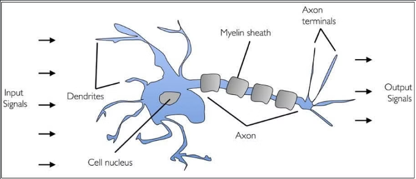

						Fig: Biological Neuron

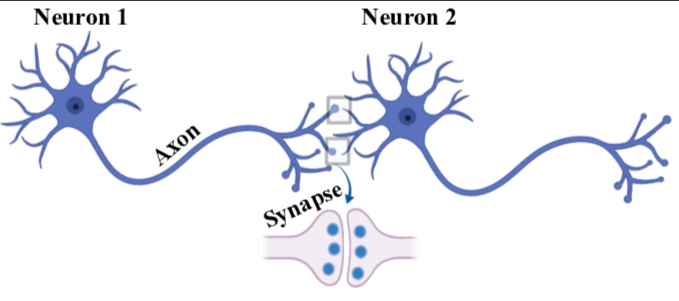

					Fig: Connection of Two Neurons 

 

Cell nucleus or Soma processes the information received from dendrites. Axon is a cable that is used by neurons to send information. Synapse is the connection between an axon and other neuron dendrites.

# Rise of Artificial Neurons (Based on Biological Neuron):

Researchers Warren McCullock and Walter Pitts published their first concept of simplified brain cells in 1943. This was called the McCullock-Pitts (MCP) neuron. They described such a nerve cell as a simple logic gate with binary outputs.

### What is Artificial Neuron?
An artificial neuron is a mathematical function based on a model of biological neurons, where each neuron takes inputs, weighs them separately, sums them up and passes this sum through a nonlinear function to produce output.

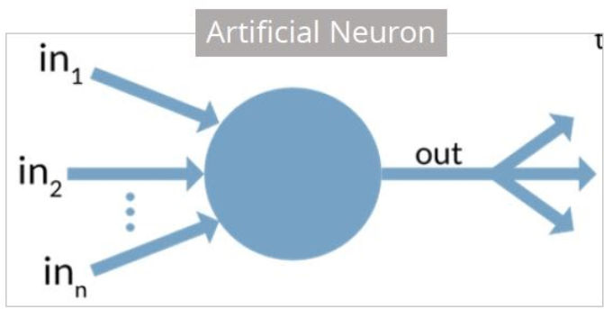

### Biological Neuron vs. Artificial Neuron:

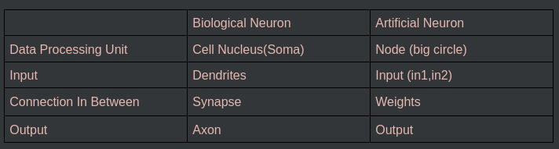

# Perceptron:

Perceptron was introduced by Frank Rosenblatt in 1957. He proposed a Perceptron learning rule based on the original MCP neuron. A Perceptron is an algorithm for supervised learning of binary classifiers. This algorithm enables neurons to learn and process elements in the training set one at a time.

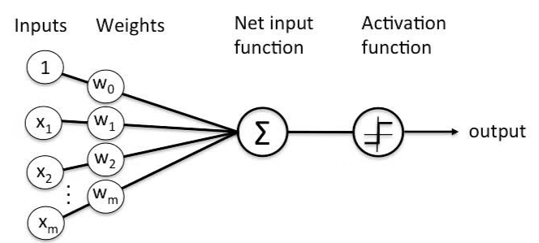

					Fig: Perceptron

### Types of Perceptron:

- **Single layer:** Single layer perceptron can learn only linearly separable patterns.

- **Multilayer:** Multilayer perceptrons can learn about two or more layers having a greater processing power.

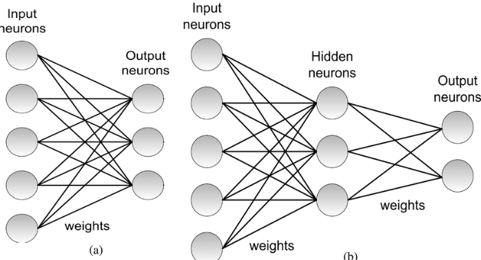

				Fig: (a) Single Layer Perceptron
				Fig: (b) Multi layer Perceptron

# Basic Components of Perceptron:

Perceptron is a type of artificial neural network, which is a fundamental concept in deep learning. The basic components of a perceptron are:

**Input Layer:** The input layer consists of one or more input neurons, which receive input signals from the external world or from other layers of the neural network.

**Weights:** Each input neuron is associated with a weight, which represents the strength of the connection between the input neuron and the output neuron.

**Bias:** A bias term is added to the input layer to provide the perceptron with additional flexibility in modeling complex patterns in the input data.

**Activation Function:** The activation function determines the output of the perceptron based on the weighted sum of the inputs and the bias term. Common activation functions used in perceptrons include the step function, sigmoid function, and ReLU function.

**Output:** The output of the perceptron is a single binary value, either 0 or 1, which indicates the class or category to which the input data belongs.

**Training Algorithm:** The perceptron is typically trained using a supervised learning algorithm such as the perceptron learning algorithm for backpropagation. During training, the weights and biases of the perceptron are adjusted to minimize the error between the predicted output and the true output for a given set of training examples.

Overall, the perceptron is a simple yet powerful algorithm that can be used to perform binary classification tasks and has paved the way for more complex neural networks used in deep learning today.

**Note:** `Supervised Learning is a type of Machine Learning used to learn models from labeled training data. It enables output prediction for future or unseen data.`

# Activation Function: 

#### Step Function: 
In Mathematics, a step function (also called a staircase function) is defined as a piecewise constant function that has only a finite number of pieces. In other words, a function on the real numbers can be described as a finite linear combination of indicator functions of given intervals.

Example: 
Draw a graph of the step function:

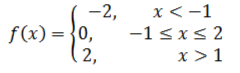

Solution:

From the given,

-2, 0, 2 are the values of y.

x < -1 means the values of x = …, -4, -3, -2, -1

-1 ≤ x ≤ 2 means, x = -1, 0, 1, 2

x > 1 means the values of x = 1, 2, 3, 4, …..

By plotting these values on a graph paper, the below graph will be obtained.

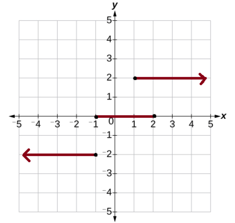

The above graph is viewed as a group of steps and hence it is also called a step function graph. The left endpoint in every step is blocked(dark dot) to show that the point is a member of the graph, and the other right end arrow indicates that the values are infinite. That means only definite values are shown with dark dots.

# What is a Binary classifier in Machine Learning?

In ML(Machine Learning)  ML algorithms can be broadly categorized into three types: supervised learning, unsupervised learning, and reinforcement learning.
- Supervised 
- Unsupervised 
- Reinforcement

In, Supervised learning there are two categories of algorithms:
 i) Classification
 ii) Regression

Binary classification is a fundamental task in machine learning, where the goal is to categorize data into one of two classes or categories.

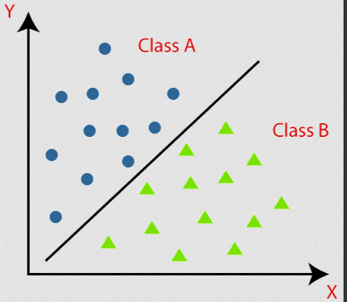

		Fig: Binary Classification

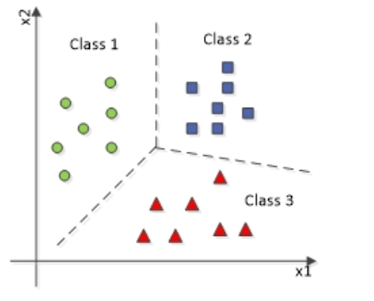

		Fig: Multi Classification

Simillary, perceptrons classify its data like Calcification. For example,
 ধরি, কয়েকটা student এর iq, cgpa and placement result দেওয়া আছে । placement হলে ১ আর না হলে 
০ । অর্থাৎ, আমাদের এইখানে দুইটা input value x1 and x2 দেওয়া আছে । আমরা algorithm এর মাধ্যমে, 
W1,W2  এবং b এর মান বের করবো । অর্থাৎ, 
To determine the perceptron value the mathematical formula is, 
∑wi*xi = x1*w1 + x2*w2 +…wn*xn
Y = f(∑wi*xi + b).

 
 

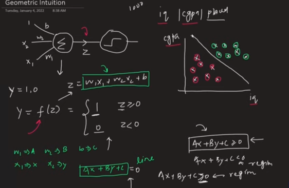

 
Now, replace W1 = A, W2 = B , b = c and X1 =x , Y1 = y we get a linear equation. Then, we make a
figure, 	in the x-axis we give IQ and in the y-axis we give CGPA then we draw a line by linear Programming . 
আমরা যেহেতু W1,W2  এবং b এর মান জানি নতুন কোন  input জন্য এর রেখার ঐ পাশে হলে বা positive হলে সেই নতুন student টি placement হওয়ার সম্ভবনা আছে । আর negative হলে এর তার কোন placemnet হওয়ার সম্ভবনা নেই । 
As the perceptron model is like binary classification that’s why we call the perceptron a binary classifier.

----
# In Bangla #
# Table of content:

- জীববৈজ্ঞানিক নিউরন কী?
- পারসেপ্ট্রন কী?
- মেশিন লার্নিং-এ পারসেপ্ট্রন
- পারসেপ্ট্রনকে বাইনারি ক্লাসিফায়ার কেন বলা হয়?

---

# জীববৈজ্ঞানিক নিউরন:

একটি মানুষের মস্তিষ্কে বিলিয়ন বিলিয়ন নিউরন থাকে। নিউরন হচ্ছে আন্তঃসংযুক্ত স্নায়ুকোষ, যা রাসায়নিক ও বৈদ্যুতিক সংকেত প্রক্রিয়াকরণ এবং প্রেরণে জড়িত। ডেনড্রাইট হলো শাখাসমূহ যা অন্য নিউরন থেকে তথ্য গ্রহণ করে।

​						**ফিগার: জীববৈজ্ঞানিক নিউরন**

​					**ফিগার: দুইটি নিউরনের সংযোগ**

সেল নিউক্লিয়াস বা সোমা ডেনড্রাইট থেকে প্রাপ্ত তথ্য প্রক্রিয়াকরণ করে। অ্যাক্সন হলো একটি কেবল যা নিউরনগুলো তথ্য প্রেরণের জন্য ব্যবহার করে। সিন্যাপ্স হচ্ছে অ্যাক্সন ও অন্য নিউরনের ডেনড্রাইটের মধ্যে সংযোগ।

---

# কৃত্রিম নিউরনের উত্থান (জীববৈজ্ঞানিক নিউরনের ভিত্তিতে):

গবেষক ওয়ারেন ম্যাককালক এবং ওয়াল্টার পিটস ১৯৪৩ সালে সরলীকৃত মস্তিষ্ক কোষের প্রথম ধারণা প্রকাশ করেন। এটি ছিল ম্যাককালক-পিটস (MCP) নিউরন। তারা এমন একটি স্নায়ুকোষকে একটি সাধারণ লজিক গেট হিসেবে বর্ণনা করেন যার আউটপুট বাইনারি হয়।

### কৃত্রিম নিউরন কী?

একটি কৃত্রিম নিউরন হলো একটি গাণিতিক ফাংশন যা জীববৈজ্ঞানিক নিউরনের একটি মডেলের উপর ভিত্তি করে তৈরি, যেখানে প্রতিটি নিউরন ইনপুট গ্রহণ করে, সেগুলোর ওজন আলাদাভাবে বিবেচনা করে, তাদের যোগফল করে এবং এই যোগফল একটি নন-লিনিয়ার ফাংশনের মাধ্যমে আউটপুট হিসেবে দেয়।

---

### জীববৈজ্ঞানিক নিউরন বনাম কৃত্রিম নিউরন:

---

# পারসেপ্ট্রন:

পারসেপ্ট্রন প্রথম প্রস্তাব করেন ফ্র্যাঙ্ক রোজেনব্লাট ১৯৫৭ সালে। তিনি মূল MCP নিউরনের উপর ভিত্তি করে একটি পারসেপ্ট্রন লার্নিং রুল প্রস্তাব করেন। পারসেপ্ট্রন একটি সুপারভাইজড লার্নিং এলগরিদম যা বাইনারি ক্লাসিফায়ার শেখার জন্য ব্যবহৃত হয়। এই এলগরিদম নিউরনকে প্রশিক্ষণ সেটের প্রতিটি উপাদান একে একে শেখার ও প্রক্রিয়া করার সক্ষমতা দেয়।

**ফিগার: পারসেপ্ট্রন**

---

### পারসেপ্ট্রনের ধরণসমূহ:

- **সিঙ্গেল লেয়ার:** এক স্তরের পারসেপ্ট্রন কেবলমাত্র রৈখিকভাবে পৃথকযোগ্য প্যাটার্ন শিখতে পারে।
- **মাল্টিলেয়ার:** একাধিক স্তরের পারসেপ্ট্রন আরও বেশি প্রসেসিং ক্ষমতা নিয়ে শিখতে পারে।

**ফিগার: (ক) সিঙ্গেল লেয়ার পারসেপ্ট্রন | (খ) মাল্টি লেয়ার পারসেপ্ট্রন**

---

# পারসেপ্ট্রনের মৌলিক উপাদানসমূহ:

পারসেপ্ট্রন হলো একটি ধরনের কৃত্রিম নিউরাল নেটওয়ার্ক, যা ডিপ লার্নিং-এর একটি মৌলিক ধারণা। পারসেপ্ট্রনের মৌলিক উপাদানসমূহ হলো:

- **ইনপুট স্তর:** বাইরের জগত বা অন্য স্তর থেকে ইনপুট গ্রহণ করে।
- **ওজন (Weights):** ইনপুট এবং আউটপুট নিউরনের মধ্যকার সংযোগের শক্তিকে নির্দেশ করে।
- **বায়াস (Bias):** অতিরিক্ত নমনীয়তা আনার জন্য ব্যবহৃত হয়।
- **অ্যাক্টিভেশন ফাংশন:** ওজনযুক্ত যোগফলের উপর ভিত্তি করে আউটপুট নির্ধারণ করে। (যেমন: স্টেপ, সিগময়েড, ReLU)
- **আউটপুট:** একটি বাইনারি মান (০ অথবা ১)
- **ট্রেনিং এলগরিদম:** সুপারভাইজড লার্নিং এলগরিদম যেমন ব্যাকপ্রোপাগেশন ব্যবহার করে শেখানো হয়।

> **বি.দ্র.:** `সুপারভাইজড লার্নিং একটি ধরনের মেশিন লার্নিং যা লেবেলড ডেটা থেকে মডেল শেখার জন্য ব্যবহৃত হয়।`

---

# অ্যাক্টিভেশন ফাংশন:

## স্টেপ ফাংশন:

স্টেপ ফাংশন (বা সিঁড়ি ফাংশন) একটি পিসওয়াইজ কনস্ট্যান্ট ফাংশন। এটি ইন্ডিকেটর ফাংশনের লিনিয়ার কম্বিনেশন হিসেবে প্রকাশ করা যায়।

উদাহরণ:

সমাধান:

- x < -1 হলে, x = …, -4, -3, -2, -1
- -1 ≤ x ≤ 2 হলে, x = -1, 0, 1, 2
- x > 1 হলে, x = 1, 2, 3, 4, …

এই মানগুলো বসালে নিচের গ্রাফটি পাওয়া যাবে:

> গ্রাফটি সিঁড়ির ধাপের মতো দেখায়, তাই একে স্টেপ ফাংশন বলা হয়। বাম পাশে কালো বিন্দু দিয়ে পয়েন্ট দেখানো হয়, ডান পাশে তীরচিহ্ন মানে অসীম পর্যন্ত প্রসারিত।

---

# মেশিন লার্নিং-এ বাইনারি ক্লাসিফায়ার কী?

মেশিন লার্নিং-এ এলগরিদম তিন ভাগে বিভক্ত:
- সুপারভাইজড
- আনসুপারভাইজড
- রিইনফোর্সমেন্ট

সুপারভাইজড লার্নিং এর মধ্যে আবার:
- **ক্লাসিফিকেশন**
- **রিগ্রেশন**

**বাইনারি ক্লাসিফিকেশন:** দুটি শ্রেণির মধ্যে ডেটা ভাগ করা।

**ফিগার: বাইনারি ক্লাসিফিকেশন**

**ফিগার: মাল্টি ক্লাসিফিকেশন**

পারসেপ্ট্রনও ডেটা ক্লাসিফাই করে। উদাহরণস্বরূপ,

ধরি, কয়েকজন ছাত্রের **IQ, CGPA এবং প্লেসমেন্ট রেজাল্ট** আছে। প্লেসমেন্ট হলে = `1`, না হলে = `0`।  

আমাদের কাছে দুটি ইনপুট x1 এবং x2 আছে। এখন আমরা এলগরিদমের মাধ্যমে W1, W2 এবং b এর মান বের করবো। 

গাণিতিক সূত্র:

∑wixi = x1w1 + x2w2 +…+xnwn
Y = f(∑wi*xi + b)

ধরি, W1 = A, W2 = B, b = c এবং X1 = x, Y1 = y  
তাহলে একটি লিনিয়ার সমীকরণ হবে। 

এক্স-অক্ষে IQ এবং ওয়াই-অক্ষে CGPA বসিয়ে রেখা অঙ্কন করলে নতুন কোনো ইনপুট যদি রেখার পজিটিভ পাশে থাকে তবে সে ছাত্রটির প্লেসমেন্ট হওয়ার সম্ভাবনা আছে, আর নেগেটিভ পাশে থাকলে সম্ভাবনা নেই।

**এই কারণে পারসেপ্ট্রনকে একটি বাইনারি ক্লাসিফায়ার বলা হয়।**

---
