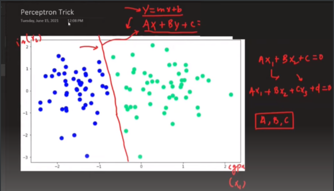
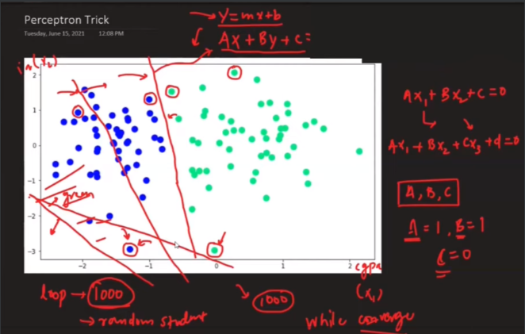
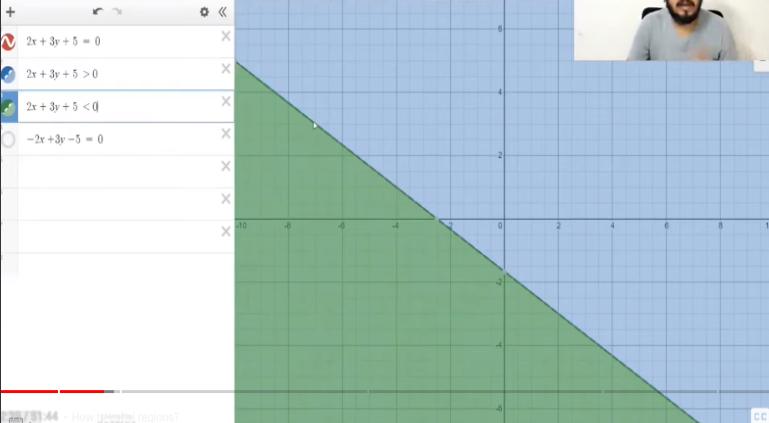
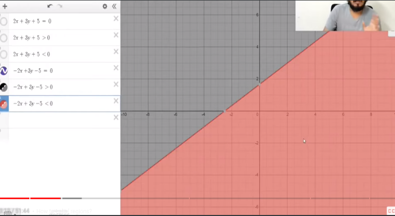
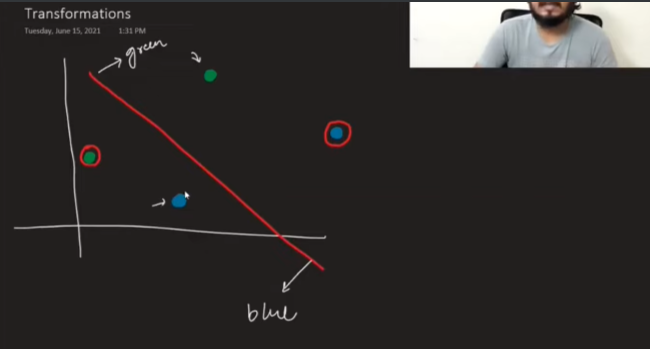
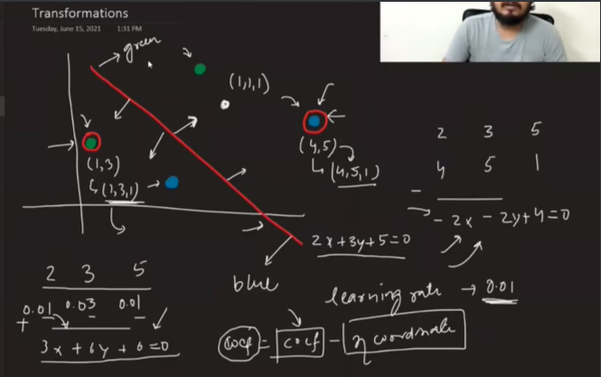
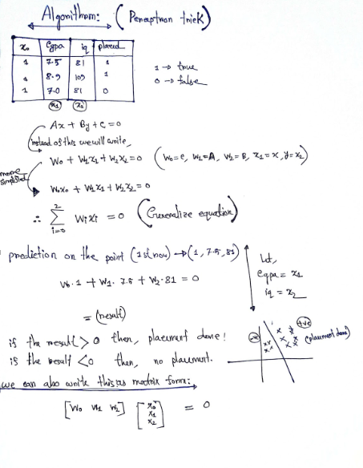
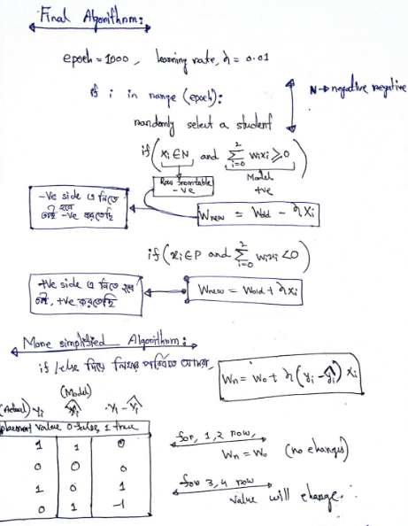

Click here for codes 👉🏻[Codes](https://github.com/AbuTaher003/Deep-Learning-DL/blob/main/Codes/05_%20Perceptron%20Trick%20%7C%20How%20to%20train%20a%20Perceptron%20%7C%20Perceptron%20Part%202%20%7C.ipynb)
---
# Perceptron Trick:

In, X-axis we have cgpa.
 
In, Y-axis we have iq.
 
Blue dot  -> Placement isn't done.
 
Green -> Placement done.
 

এখন, নতুন কোন  value এর জন্য ওই student এর placement  হয়েছে কি না, তা জানার জন্য জন্য ডেটা গুলো কে plot করে একটা straight line  বের করবো যার ডান পাশে কোন বিন্দু থাকলে তার placement হয়েছে আর বাম পাশে থাকলে তার placement হয়নি । 

 
 এখন এই straight line  টা কিভাবে বের করবো (the value of A, B and C) এর জন্য আমারা Perception Trick শিখবো । 
As the perceptron model is like binary classification that’s why we call the perceptron a binary classifier.

আমরা প্রথমে একটা লাইন নিব randomly,  উপরের চিত্রে x-axis এর -2 and -1 এর মাঝের লাইন টা নিয়েছি । তারপর x-axis এ  -1 উপর যে point  টা আছে তাকে  ask করবো তুমি কি তোমার সঠিক জায়গায় আছো ??? তোমার কি placement  হবে ???   
Ans: no .  
তাইলে, আমরা A,B,C এর ভ্যালু change করে লাইন টাকে ওই  point এর ঐ পাশে দিয়ে নিয়ে new line make করতে হবে (যেইটা, x-axis এ  ০ এর উপর দিয়ে দিয়ে গিয়েছে । এইভাবে অন্য সব  point গুলোকে লাইনের equation    বসিয়ে সবচেয়ে best fit লাইনটা বের করতে হবে ।  
 

### How the straight line will behave if we change the value of: 

1.  Changing (c):
   - Increasing C shifts the line downward.
   - Decreasing C shifts the line upward.

2. Changing a:
   X এর সহগ হলো a । লাইনটা যেই দিকে থাকুক না কেন a  এর মান change করলে এটা y -axis এর সাথে সমান্তরাল হওয়ার চেষ্টা করবে । 

3. Changing b: 
    Y এর সহগ হলো b । লাইনটা যেই দিকে থাকুক না কেন b  এর মান change করলে এটা x -axis এর সাথে সমান্তরাল হওয়ার চেষ্টা করবে । 

Y - axis কে কেন্দ্র করে 

 We can visualize  this in any online websites:  [desmos_calculator](https://www.desmos.com/calculator)

 

### Where a Point is lying the positive region or negative region or on the line?
For, 2x + 3y + 5 =0 line,

( Red region line equation given in the picture.)
( Blue region line equation given in the picture. )

 
For, -2x + 3y -5 =0 line,
 

# Example: 

Transform this . blue point for placement ( যেইটা blue point এর direction যেইদিকে দেওয়া আছে সেইদিকে রাখতে হবে simillary for green point)  . And the equation of the line is,  

2x+3y+5=0 .

তাহলে আমাকে যেই দুইটা point গোল দাগ দেওয়া  আছে সেই দুইটা point এর সাপেক্ষে আমাদের লাইন টা change করতে হবে । 

### Solution: 
Step to follow to transform the line given below: 

(4,5) point টা red line এর +ve region এ আসে, কিন্তু সঠিক orientation এর জন্য একে (2x+3y+5=0) এর  negative region এ নিয়ে আসবে হবে । তাই আমরা প্রথমে base line(2x+3y+5=0) এর সহগ গুলো লিখে (2,3,5) এর নিচে সেই (4,5)এর সাথে 1 add করবো (4,5,1) then subtraction করবো ।   
2 	 3 	 5  
(-)  4	 5	 1   
—---------------------------------------  
-2	-3	4 

 
New equation, -2x -2y + 4 = 0

Similarly , positive region এ নিয়ে যেতে হলে আমরা একে + করবো । 

কিন্তু, সমস্যা হচ্ছে আমরা এত বড় transformation করতে পারি না । তাই আমরা 4, 5 , 1 এর পরির্বতে এইগুলো কে একটা ছোট সংখ্যা দিয়ে গুন করি তারপর বিয়োগ করি । একে learning rate বলে । 

New co-efficient = old coefficient - (learning rate * 1 adding points)

### Algorithm To Solve A Problem:

