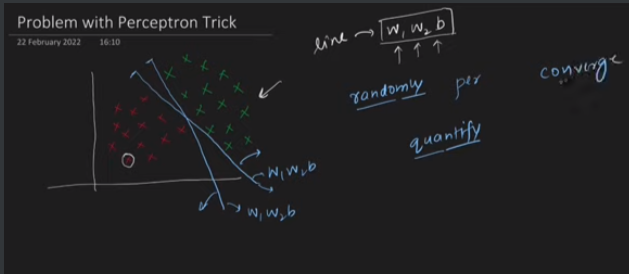
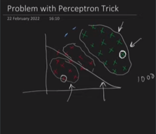
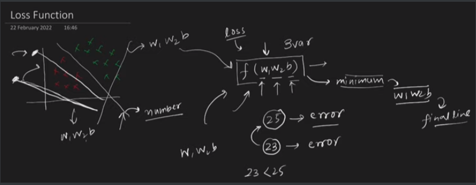
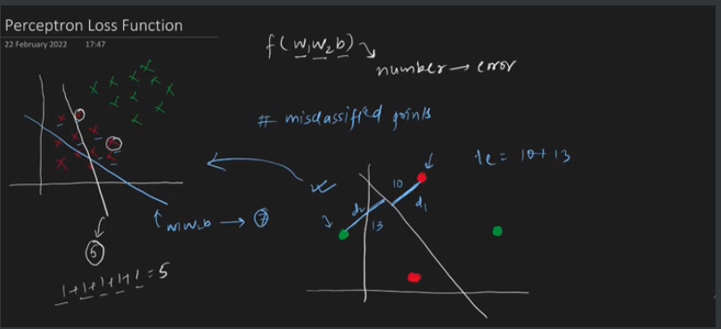
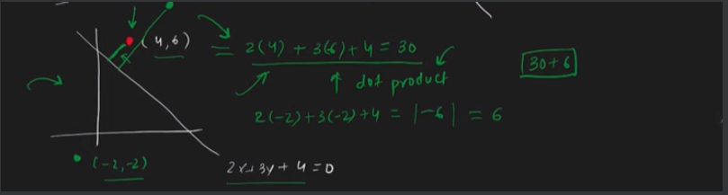
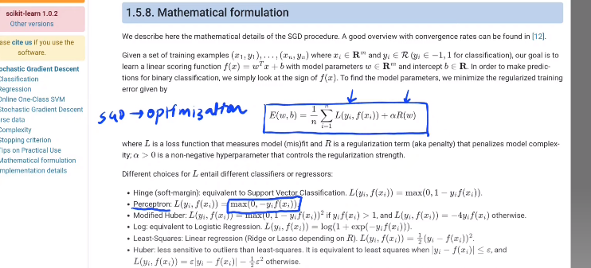
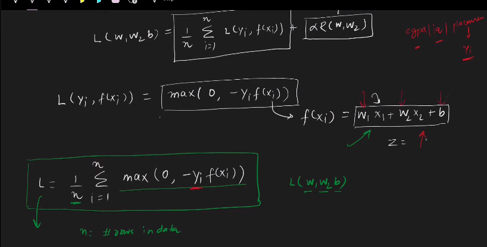
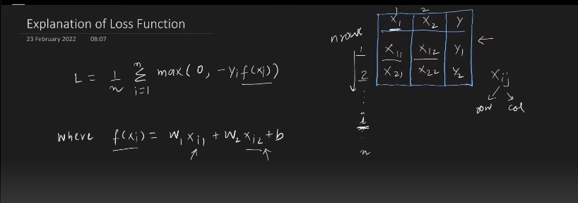
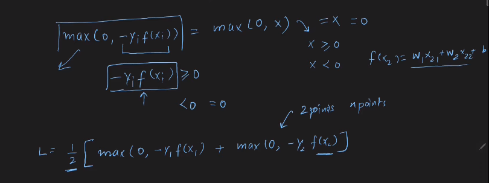
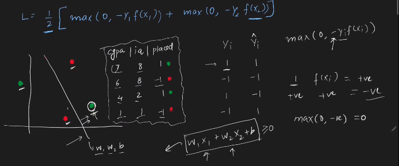

Click here for codes 👉🏻[click](https://github.com/AbuTaher003/Deep-Learning-DL/blob/main/Codes/06_Perceptron%20Loss%20Function%20%7C%20Hinge%20Loss%20%7C%20Binary%20Cross%20Entropy%20%7C%20Sigmoid%20Function.ipynb)
---

# Lost Function: (Lecture-06)

## Problem with perceptron Trick : 

- 1st problem) এক্ষেত্রে দুইটা লাইন ঐ ঠিক। কিন্তু কার ভ্যালু কত  accurate বা কোনটা better line  তা perceptron trick quantify করতে পারে না । 

- problem 2) এক্ষেত্রে সমস্যা হচ্ছে, আমরা যেই ১০০০ বার লুপ ঘুরাবো সেই ১০০০ বার  same point select হয় । যদিও এর সম্ভবনা খুব কম । 

এখন সবচেয়ে ভালো trick হলো perciption trick ব্যবহার না করে lost function ব্যবহার করা । সহগ গুলোর মান বের করার জন্য । 

# Loss Function:  ( IN ALSO ML-> Machine Learning)

The loss function is a method of evaluating how well your machine learning algorithm models your featured data set. In other words, loss functions are a measurement of how good your model is in terms of predicting the expected outcome.

### What is loss function: 
Although there are different types of loss functions, fundamentally, they all operate by quantifying the difference between a **model's predictions** and the **actual target** value in the dataset. The official term for this numerical quantification is the **prediction error**. The learning algorithm and mechanisms in a machine learning model are optimized to minimize the prediction error, so this means that after a calculation of the value for the loss function, which is determined by the prediction error, the learning algorithm leverages this information to conduct weight and parameter updates which in effect during the next training pass leads to a lower prediction error.

Like, এখানে একটা ফাংশন বানানো আছে । এর মধ্যে আমরা যার জন্য ভ্যালু (W1,W2,b) provide করলে যার জন্য আমরা  prediction error পাবো ।  উপরের ছবিতে যার prediction error 23 সেই function এর W1,W2,b এর ভ্যালু গুলো দিয়ে যে রেখা পাবো সেইটা best fit করবে । 

`বিভিন্ন সমস্যা সমাধানের জন্য বিভিন্ন ধরনের lost function আছে । ml এ আমরা I) Stochastic Gradient Descent II) Batch Gradient Descent III) Mini Batch Gradient Descent । here, Gradient Descent = loss function . Perceptron এর জন্য আমরা perceptron loss function নিয়ে পড়বো ।`

# Perceptron Loss Function: 

Loss Function is a mathematical function. যেইটা আমাদের একটা number দিবে । সেইটা সেই model এর prediction error । 

এখানে, ১ম চিত্রে কোন রেখার উপর  যতগুলো misclassified point আছে তাদের সবগুলোর মান এক ধরে তাদের মোট prediction error  বের করা হয়েছে যেই টা ঠিক না । কারণ, মূলবিন্দু থেকে যার দূরত্ব বেশি তার  prediction error তত বেশি । 

তাই, ডানপাশের চিত্রে ঐ রেখা থেকে তাদের লম্ব দুরত্ব কত তা বের করে যোগ করা হয়েছে। যেহেতু রেখার দুরত্ব বের করা complex

তাই, আমরা রেখার লাইনে cordinate এর মান গুলো বসিয়ে prediction error calculation করি । এইটা আর রেখার থেকে লম্ব দুরত্ব বের করা proportional. Overall, ভ্যালু গুলোর mod নিয়ে negative value আসলে । 

# Documentation in sk-learn Stochastic Gradient Descent

এখানে, L(loss) দিয়ে একটা term আছে আর R (Regularization) দিয়ে আরেকটা term আছে । 
perceptron এর জন্য L(loss) function টা কেমন হবে তা নিচে নিচে দেওয়া আছে । perceptron এর জন্য L function অনেক টা Hinge loss function এর মতোই । কিন্তু, Hinge loss function এ ১-similar term আছে । 

আমরা আপাতত regularization কে ignore করবো। L(loss) function এ f(x_i) হলে আমাদের সেই লাইন টা বা মডেলটা আর y_i হলো output iq,cgpa এর example এর ক্ষেত্রে placedment হচ্ছে y_i আর n হচ্ছে number of row in dataset । 

`অর্থাৎ আমাদের (W_1,W_2,b) এর এমন ভ্যালু বের করতে হবে যার কারণে L(loss) function এর মান মিনিমাম আসবে। এর জন্য আমরা gradient decent ব্যবহার করি । ` 

# Explanation of Loss Function:

আমরা প্রথমে এই table টার explanation দেখি । Table টা matrix এর মতো যেখানে, element গুলো X_ij দিয়ে representation করা হয়েছে । যেখানে, i হচ্ছে row আর j হচ্ছে column । 

আমাদের কাছে দুইটা datapoint আছে অর্থাৎ আমাদের n = 2 সেক্ষেত্রে, L এর মান দুইটা হবে । f(x1) = w1X11 + w2 X12 + b । f(x2) এর টা উপরের ছবিতে দেওয়া আছে । 

 
Example:  

