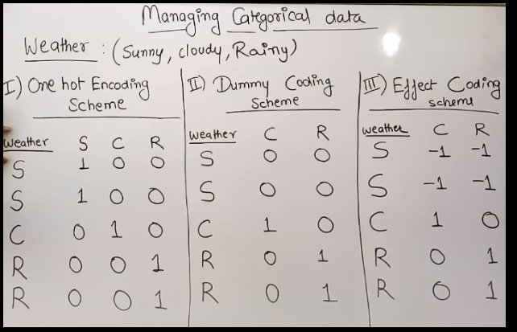

Click here for codes 👉🏻[click](https://www.kaggle.com/code/abutaher03/customer-churn-prediction-using-ann)
---

# Customer Churn Prediction: (With keras and Tensorflow)

---

# About the dataset and problem statement:

 

- **binary class classification probem**

- এইটা একটা **classification dataset** এবং এখানে customer এর অনেক গুলো info দেওয়া আছে । তাদের activity দেখে আমাদের বলতে হবে কোন customer future এ আমাদের bank এর সার্ভিস বা bank ছেড়ে চলে যাবে । 

 

### Code implementation: (that will help us to understand backpropagation algorithrm)

---

# Prerequsite:

---

# Managing Categorical Data

### Managing categorical data is to convert it into numerical form using techniques like:
- One Hot Encoding Scheme 
- Dummy Coding Scheme
- Effect Coding Scheme

### One hot Encoding:
 এক্ষেত্রে আমরা একটা vector make করবো । যেমনঃ উপরের উদাহারনে Weather categorical data এর  ৩ টা label (sunny,cloudy,rainy) আছে । এর মধ্যে যার ভ্যালু true হবে vector এ একটা sequence অনুয়ায়ী সেই vector এর component এর মান ১ হবে বাকি গুলো ০ হবে । 

### Dummy Coding Scheme:
এক্ষেত্রে, One hot Encoding এর মতোই কিন্তু  আমাদের যতগুলো label থাকবে তার থেকে একটা  label কমিয়ে  represent করবো । 

### Effect Coding Scheme: 
এক্ষেত্রে, Dummy Coding Scheme এর মতোই কিন্তু দুইটা component 0 হলে তাদের পরবর্তীতে -১ দিয়ে দিব । কিন্তু দুইটাই যদি 0 না হলে তাহলে  dummy coding এর মতোই রেখে দিব । 

   

