---

# Loss Function in Deep Learning

---

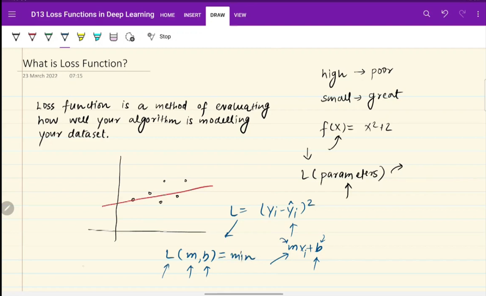

`loss function দিয়ে আমরা measure  করি আমাদের মডেল কত ভালো বা কত খারাপ । যদি  loss function এর মান অনেক বেশি হয় তাহলে আমাদের মডেল খারাপ আর যদি কম হয় তাহলে আমাদের মডেল ভালো । লস কে minimize করার জন্য আমরা neural network এর parameter এর মান গুলো change করি । ` 

- loss function একটা mathematical function যার input হিসেবে neural network এর parameter গুলো দেই । 
- আমরা Linear Regression problem solve করার সময় আমরা **mean_squared_error** ব্যবহার করি । 

# Why loss function is important?
`You can't improve what you can't measure.` --🗣️ Peter Drucker

 

# How loss function is worked in neural network?
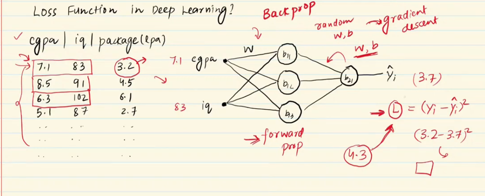

 

Neural Network এ আমরা প্রথমে weight and bias এর random value দিয়ে শুরু করি । Neural Network train করার সময় আমরা যখন একটা student এর info গুলো neural network এর মধ্যে যায় তখন `forward propagation` এর মাধ্যমে এর Y_output (prediction of the model) বের করি । তারপর, আমরা `mean_squared_error` এর মাধ্যমে loss calculate করে একটা নাম্বার(loss) পাবো । এই loss এর উপর ভিত্তি করে `আমরা neural network এর পেছনে গিয়ে`  weight and bias এর ভ্যালু গুলো adjust করি `gradient descent` এর মাধ্যমে । তারপর, আবার Y_output (prediction of the model) এর মান বের করে minimum loss এর জন্য weight and bias এর ভ্যালু গুলো adjust করি। 

 

# Type of loss function in deep learning:

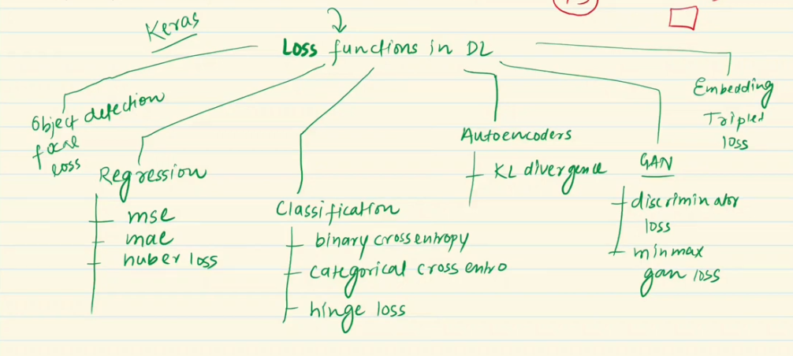

`keras আমাদের কে আমাদের নিজের loss function implement করার functionality provide করে । `

 

# Loss Function vs Cost Function:

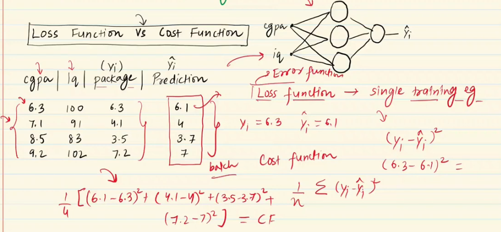

`loss function শুধু একটা single dataset এর entity বা row  এর উপর কাজ করে । কিন্তু, cost function(এর equation ছবিতে দেওয়া আছে) পুরো একটা batch বা একটা epochs এর উপর কাজ করে । `

 

# Mean Squared Error Function:

- Use in regression problem

- আমরা কেন square করি? 
(y - y_out) করলে difference negative হতে পারে । square করা ছাড়া যোগ করলে negative এর কারণে overall error কমে যাবে । কিন্তু, বাস্তবে তো error value reduce হবে না । 

- Relation of error with bias and weight.
এখানে আমরা square করছি । অর্থাৎ, (y - y_out) এর ভ্যালু বা y_out এর ভ্যালু যত বড় হবে । error তত magnify হবে । error যত বড় হবে weight and bias এর ভ্যালু তত drastic বা বেশি হবে  বা weight and bias এর আপডেট তত বেশি হবে ।

 

### Advantage and Disadvantage of Mean_Squared_Error Loss Function:

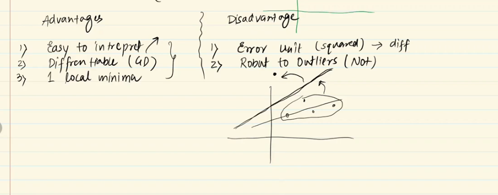

`Disadvantage:`
- outliers কে  fix করার জন্য মডেল এর output অনেক বেশি হয়ে যাবে । যেইটা কাম্য নয় । তাই  outliears থাকলে আমরা mean_squared_error ব্যবহার করি না । 

`mean_squared_error ব্যবহার করার শর্ত হলো আউটপুট লেয়ারের activation function অব্যশই অব্যশই linear হতে হবে । `

 

# Mean Absolute Error:

- Use in regression problem

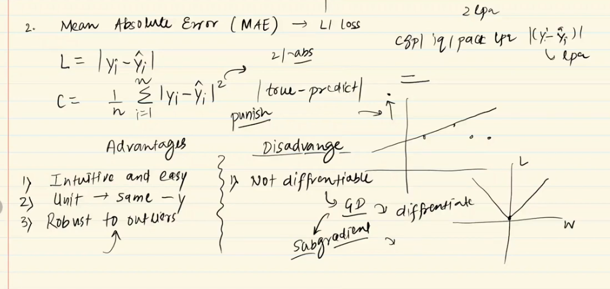

- Mean_Squared_Error Loss Function এর মতোই কিন্তু Square এর পরবর্তিতে absolute value ব্যবহার করি । 
- Outliears কে ভালোভাবে handle করতে পারে ।  
- এইটা কে differentiation করা যায় না । আর যেহেতু, gradient decent একদম differentiation এর উপর নির্ভরশীল তাই আমরা gradient decent apply করতে পারি না । এখানে, আমরা sub-gradient decent apply করি ।  

 

# Huber Loss Function:

- Use in regression problem

আমাদের outliers এর ডাটা 25% এর মতো থাকলে তাহলে সেইগুলোকে আর outliers হিসেবে গণ্য করা যায় না । এই ধরনের সমস্যার ক্ষেত্রে আমাদের mean_squared_error function and mean_absolute_error ঠিক ঠাক মতো কাজ করে না । 
তাই আমাদের **huber loss function** এর প্রয়োজন হয়েছে ।

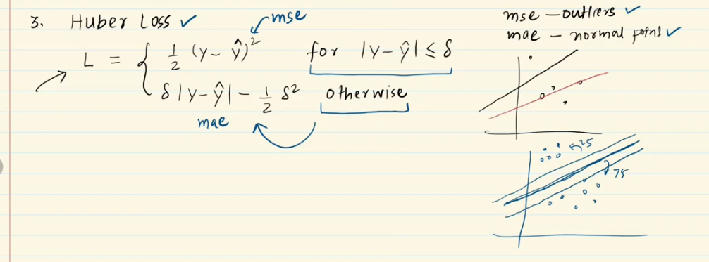

- outliers না থাকলে Huber Loss Function -> mean_squared_error loss function হিসেবে কাজ করে । 

- outliers থাকলে Huber Loss Function -> mean_absolute_error loss function হিসেবে কাজ করে । 

`outliers আছে কি না নেই তা গামা(hyperparameter) দিয়ে নির্ধারণ হবে । `
 

# Binary Cross Entrophy loss function বা  log loss function:
 
-  Use in classification problem ।

-  আমাদের কাছে দুইটা class থাকে । (Binary classification problem)

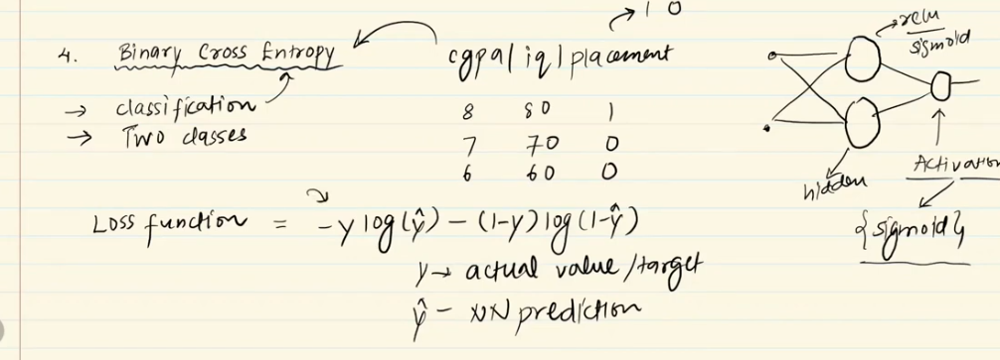

`Binary Cross Entrophy Loss Function ব্যবহার করার শর্ত হলো আউটপুট লেয়ারের activation function অব্যশই অব্যশই sigmoid হতে হবে । `

- Cost function formula in Binary Cross Entrophy

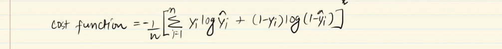

- `Cost function এর  working procedure:` Neural Network এ আমরা প্রথমে weight and bias এর random value দিয়ে শুরু করি । Neural Network train করার সময় আমরা যখন একটা student এর info গুলো neural network এর মধ্যে যায় তখন `forward propagation` এর মাধ্যমে এর Y_output (prediction of the model) বের করি । তারপর, আমরা `binary_cross_entrophy` এর মাধ্যমে loss calculate করে একটা নাম্বার(loss) পাবো । এই loss এর উপর ভিত্তি করে `আমরা neural network এর পেছনে গিয়ে`  weight and bias এর ভ্যালু গুলো adjust করি `gradient descent` এর মাধ্যমে । তারপর, আবার Y_output (prediction of the model) এর মান বের করে minimum loss এর জন্য weight and bias এর ভ্যালু গুলো adjust করি।  

`Disadvantage:`
- multiple loacl minima থাকবে ।  

 

# Categorial Cross Entrophy Loss Function: 

-  Use in classification problem ।

- দুইটা এর অধিক class থাকলে । (Multi-Classification Problem)

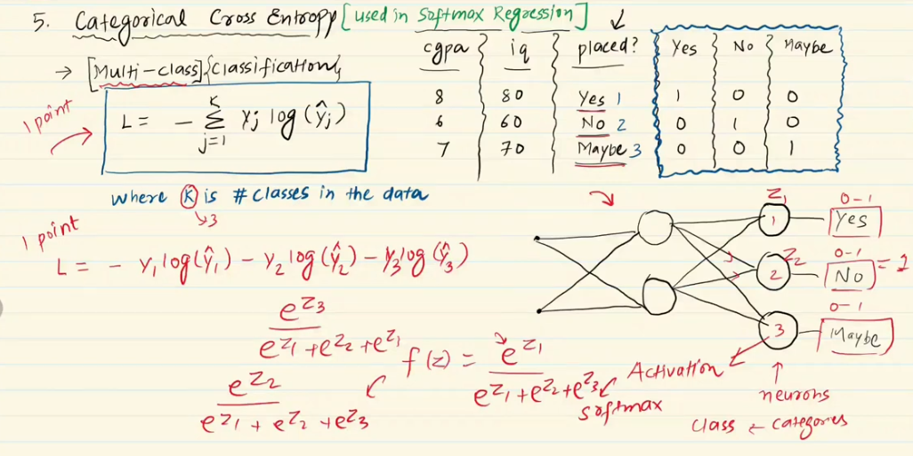

- output layer এ আমাদের যতগুলো class থাকবে ঠিক তত গুলো node থাকবে । 
- Activation হিসেবে softmax activation function ব্যবহার করবো । উপরের ছবিতে, Yes এর জন্য ফাংশন এর উপরে e^z1 
- উপরের ছবিতে, No এর জন্য ফাংশন এর উপরে e^z2 
- উপরের ছবিতে, Maybe এর জন্য ফাংশন এর উপরে e^z3

 

- Cross Entrophy Loss Function ব্যবহার করার জন্য আমরা প্রথমে output কলামে  One hot encoding প্রয়োগ করি ।  

- dataset থেকে ৮ , ৮০ ইনপুট দিলে, 
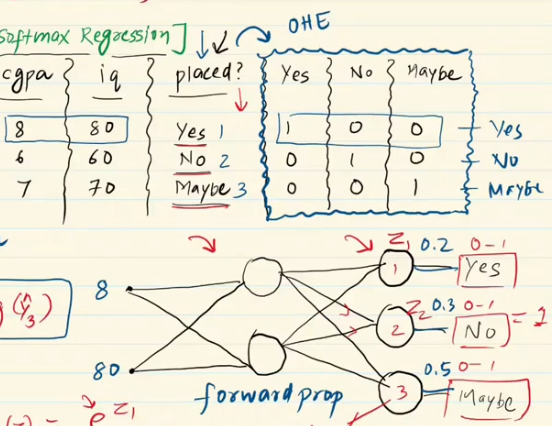

আমরা output layer এ ৩ টা নোড এর জন্য ৩ টা output পাবো range to (0~1) । এখন এই তিনটার জন্য আমরা লস হিসাব করবো। 

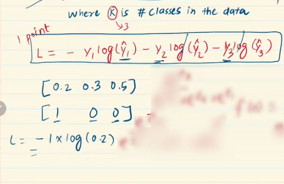

তারপর, gradient decent apply করে weight and bias update করবো  ।  test data এর ক্ষেত্রে, তিনটার মধ্যে যার probability সবচেয়ে বেশি আসবে সেইটাই হবে আমাদের উত্তর ।  

 

# Sparce Categorical Entrophy loss function:

**Sparce Categorial Entrophy and Categorical Cross Entrophy দুইটা সেমই কিন্তু আমরা categorical cross entrophy এর ক্ষেত্রে আমরা one hot encoding ব্যবহার করি । আর Sparce Categorical Entrophy এর ক্ষেত্রে আমরা integer hot coding করি । উপরের এক্সামপোল এ integer hot coding এ yes no and maybe কে তিনটা integer assign করি ।**

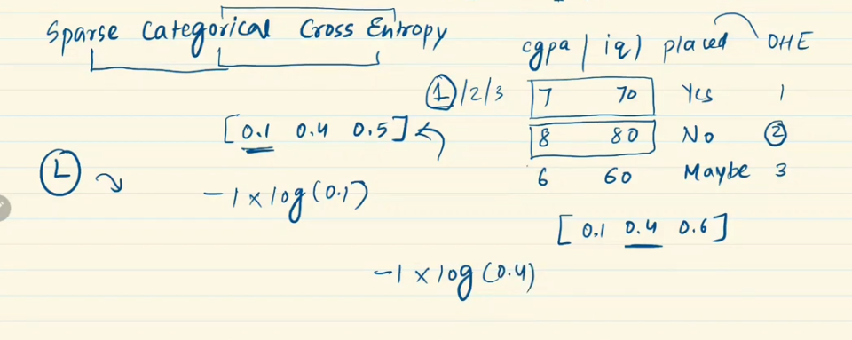

- Categorical Cross Entrophy formula দিয়েই  করবো । কিন্তু, এখানে, আমাদের ডাটা(row) এ যেই লেভেল(1,2,3) থাকবে formula তে সেই term টা ছাড়া বাকি গুলোর মান ০ বসিয়ে লস হিসাব করবো । 

### Formula of cost function:

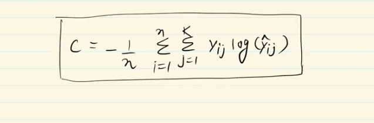

`Advantage:`
- এইটা তে যেহেতু আমাদের ডাটা(row) এ যেই লেভেল(1,2,3) থাকবে  formula তে সেই term টা ছাড়া বাকি গুলোর মান ০ বসিয়ে লস হিসাব তাই এইটা Categorical cross entrophy এর থেকে fast হয়। 

