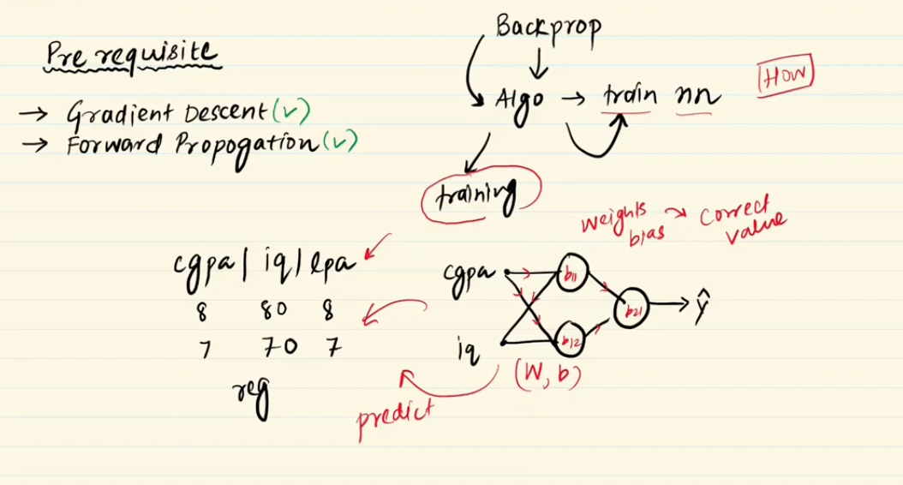
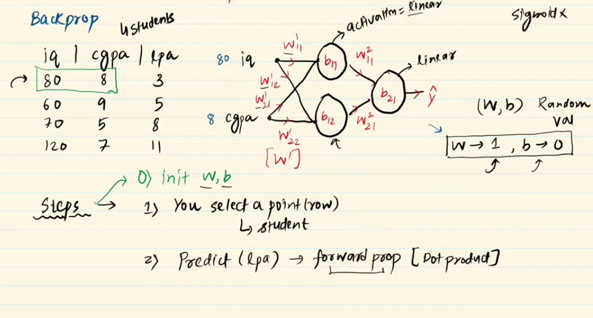
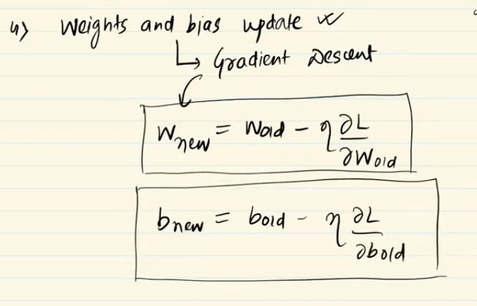
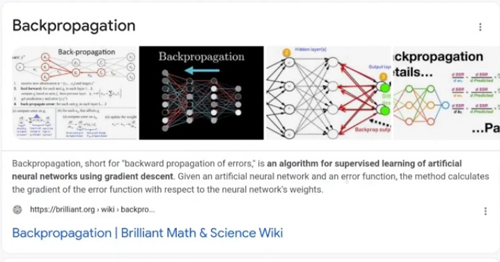

For Hand notes you can check here 👉🏻 [Note](https://drive.google.com/file/d/1jIHPl8kmqQtvLFhD8SZPmSl0FbP_wPiv/view?usp=drive_link)
---
 

---

# Back_Propogation:

---

 

**Back Propogation:** Is an algorithm to train a neural network.

**What is training of a neural network :** Find out the most accurate value of weights and bias .

 

**How we can find the best accureate value of weights and bias:**
 
- শুরুতে আমরা, weights and bias random value দিয়ে শুরু করি  বা weights=1 and bias=0 ধরে শুরু করি । আমরা এইখানে weights=1 and bias=0  শুরু করবো। 

- activation function: **linear** then **forward propogation** to determine the predicted value.

- predicted value  আর actual value difference অনেক বেশি । কারণ, আমরা  weights and bias random value দিয়ে শুরু করেছিলাম । তাই এখন আমাদের লস বা error নির্নয় করতে হবে loss function দিয় । 

- loss শুধু মাত্র  predicted value এর উপর নির্ভর করে আবার predicted value শুধু মাত্র weights and bias value এর উপর নির্ভর করে। তাই আমরা neural network পিছনে গিয়ে weight and bias এর ভ্যালু গুলো adjust করবো(using gradient decent) এইটায় হচ্ছে backpopogation of neural network । 

   

এখন আমরা Defination টা বুঝবো ভালো ভাবে । 

 

**Output layer, hidden layer  এর weight and bias মান কীভাবে করতে হয় তা আমরা ml এ শিখেছিলাম ।** 

