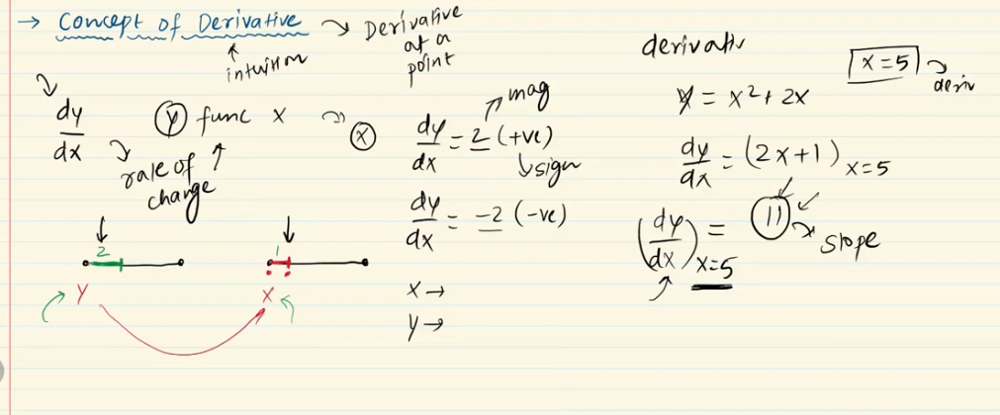
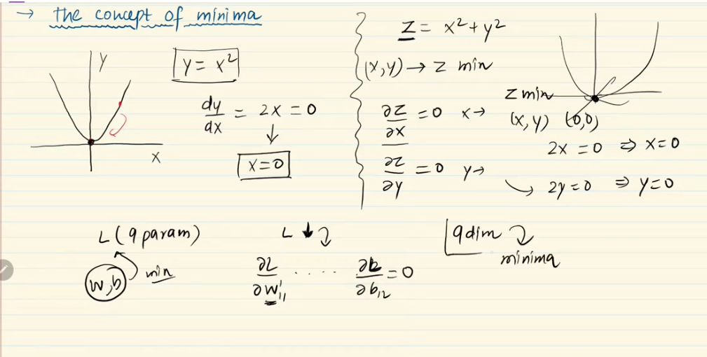
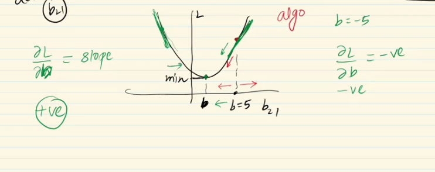
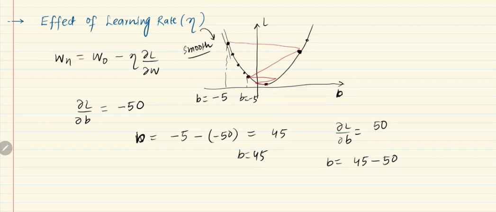

---

# Backpopogation: (Why কেন এইটা সঠিক ভাবে কাজ করে ? আমাদের সঠিক রেজাল্ট দেয় ? )

---

### Revise the backpopogation algorithrm:

---

# Let's understand: `Lost Function is a function of all trainable parameter`

- আমরা একটা regression প্রবলেম এর সমাধান করতেছি । 
- লস ফাংশন হিসেবে `mse(mean_squared_error)` আর activation function  হিসেবে `liner` ব্যবহার করতেছি । 
- আমাদের লস ফাংশন (y - y_bar) যেখানে, y হলো constant । তাই লস ফাংশন শুধু মাত্র y_bar এর উপর নির্ভরশীল । 
- `forward propogation` এর মাধ্যমে আমরা y_bar এর ফরর্মূলা নির্ণয় করলাম । এখান থেকে আমরা ক্লিয়ার যে `Lost Function is a function of all trainable parameter`। 

`আমাদের লস ফাংশন সকল parameter(weight,bias) এর উপর নির্ভশীল । একটা বা সবগুলোর weight or bias ভ্যালু change করলে লস change  হবে .`

---

# Let's talk about `Gradient Descent:`

- Gradient descent হলো একটা optimization algorithrm যেইটা minimize করে loss (loss function) by updating the model parameters (such as weights and biases)।

- Gradient descent আমরা derivative নির্নয় করি । Derivative নির্ণয় করার মানে হলো `slope` নির্ণয় করা । 

---

# Let's talk about `Concept of Derivative:`

- derivative means rate of change. 

- `dy/dx = 2 , (+Ve)` X এ ১ unit change করার ফলে y এ পজিটিভ ২ unit পরিবতিত হয় । 

- `dy/dx = -2 , (-e)` X এ ১ unit chagne করার ফলে y এ নেগিটিভ ২ পরিবতিত হয় । 

` অর্থাৎ, শুরু মান নয় মান সহ চিহ্ন ও গুরুত্বর্পূণ । `

- Derivative at a point বলতে সেই point এর slope কে বুঝায় । 

`weight or bias এ চেইজ করার ফলে লস ফাংশনে কেমন চেইজ হচ্ছে তা ডেরিভেটিভস দিয়ে বের করতে পারছি । `

---

# Let's talk about `The concept of minima:`

- আমাদের ফাইনাল objective হচ্ছে Loss reduce করা । অর্থাৎ minima বের করা । এর জন্য আমাদের আগে ডেরিবেটিভ     (এক এর অধিক চলক থাকলে  partial derivative করতে হবে ) করতে হবে তারপর সেইটা = ০ ধরে minima বের করতে হবে । 

---

# Let's talk about ` Backpopagation intution: `

### `W_new = W_old - dL/dw_old` কেন - ব্যবহার করলাম ? 

- `W_new = W_old - dL/dw_old` কেন - ব্যবহার করলাম ? 
- b = 5, তখন, `slope positive` and `minima` বের করার জন্য আমাদের পুরানো ভ্যালু থেকে বাদ দিতে হবে । 
- b = - 5, তখন, `slope negative` and `minima` বের করার জন্য আমাদের পুরানো ভ্যালু থেকে যোগ করতে হবে । 

### `Learning Rate:`

- `learning rate` না থাকলে slope এত বেশি  বা কম আসতো যা দিয়ে কখনোই `minima` তে যাওয়া possible না । 
- `learning rate` না থাকলে slope এর change এর zigzag মতো হতো  **(উপরের চিত্র এর মতো)**  যেইটা কখনোই ভালো নয় । 

pratical demo: [link](https://developers.google.com/machine-learning/crash-course/fitter/graph)

### What is convergence?

- আমরা এর ভ্যালু কত সেট করি? 

- `W_new = W_old - dL/dw_old` convergence means when `W_new` value is close to `W_old` value. when we reach near to the minima the value of (learning rate*dL/dw_old) is close to zero.

- কিন্তু, আমরা এইটা কোন শর্ত না প্রয়োগ করে epochs এর ভ্যালু ১০০০ এর দিয়ে দেই । 

