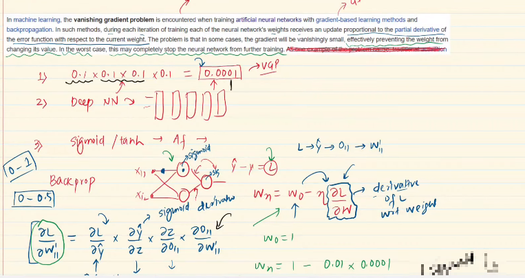
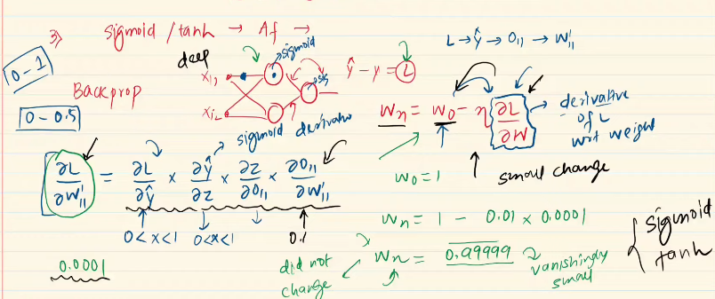
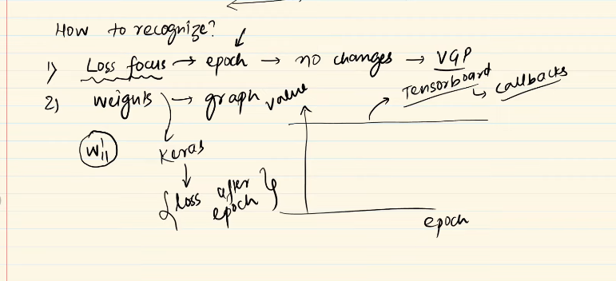
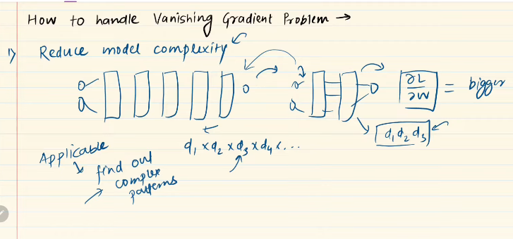
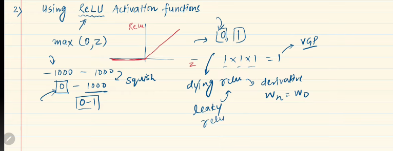
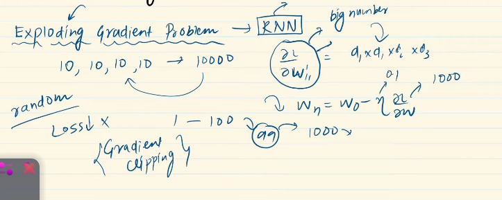

For codes click [here](https://github.com/AbuTaher003/Deep-Learning-DL/blob/main/Codes/20_Vanishing_Gradient_Descent.ipynb)
---

# Vanishing Gradient 

`Neural Network train করার সময় আমরা কিছু সমস্যার সম্মুক্ষীন হয় । এর মধ্যে একটা হচ্ছে Vanishing Gradient । Vanishing Gradient হলে Neural Network ভালোভাবে train হতে পারে না । `

- `দুইটা এক এর থেকে ছোট সংখ্যা গুন করলে সেইটা আর ছোট হতে থাকে । `

- `Deep Neural Network এর ক্ষেত্রে এই সমস্যা দেখা দেয় । `

- `activation function sigmoid or tanH হলে সাধারণত এই সমস্যা গুলো দেখা দেয় ।`

- `weight and bias update Using Backpropogation and Gradient descent এর ক্ষেত্রে এর মান ০~১ এই range হয় । এই ক্ষেত্রে activation function এর আউটপুটগুলোর এর মান ১ এর থেকে ছোট হয় । তাই (GD-> derivation)এর মান গুলোর গুনফল এত ছোট হবে যে, weight and bias update বা convergence অনেক অনেক কম হবে । আমাদের weight and bias এত কম ভ্যালু তে change হলে, আমরা accurate weight and bias পাবো না । আবার অনেক সময়, worst case এর ক্ষেত্রে weight and bias change  হবেই না । তাই লস ফানংশন ও change হবে না ।`
 

`1 দিয়ে example এর ক্ষেত্রে new weight value Vanishingly small  তাই এখান থেকে নাম এসেছে  **Vanishing Gradient** `

 

---

# কিভাবে বুঝবো আমাদের Vanishing Gradient হচ্ছে ?

i) loss is not changing.
ii) Drawing the graph of weights

---

Code Demo

---

# How to solve this vanishing gradient problem.

`আমরা total 5টা way দেখবো এর মধ্যে আমরা দুই টা এই ভিডিওতে দেখবো । `

# Number ONE:

- **Reduce Model Complexity:** আমরা যদি  hidden layer এর সংখ্যা কমিয়ে দেয় তাহলে এই প্রবলেম এর সমস্যার সমাধান করতে পারবো । কিন্তু, আমরা hidden layer এর সংখ্যা বাড়িয়ে ছিলাম একটা complex প্রবলেমকে করার জন্য । কিন্তু এইটা (reduce the number of hidden layer) হলে তো আমরা আর complex প্রবলেমটা  solve করতে পারবো না । `আর যদি প্রবলেম টা complex না হয় সেক্ষেত্রে এইটা কাজ করবে । `

 

---

Code Demo With Previous Problem

---

# Number Two:

 
Using different actication function (generally we use `Relu`):
 

- `relu activation function: ` (0~z) (Z is a positive number) এই range এ নিয়ে আসে । relu activation function এর  output কে  differentiation করলে সেইটার উত্তর ০ বা ১ আসে । অনেক গুলো ১ * ১ * ১ = ১ গুন হলে উওর ১ ঐ আসে  তাই আর Vanishing Gradient প্রবলেমের মধ্যে পড়তে হয় না। নেগিটিভ ভ্যালু থাকলে সেইটাকে 0 তে নিয়ে আসে, তাই dying relu একটা প্রবলেমের দেখা দেয় । এইটা থেকে বাচার জন্য আমরা Leaky Relu ব্যবহার করবো এই গুলো আমরা পরে দেখবো । 

---

code demo

---

# Number Three: 

`Proper weight Initialization: এখন, আমরা randomly weight initialization করেছি । কিন্তু, আর কয়েকটা লেকচারের পর xavier glorot weight initialization technique দেখবো । `

---

# Number Four:

`Batch Normalization: এইটা পরে দেখবো । `

---

# Number Five:

`Residual Network:` buliding block of `ANN`, In `CNN`, we will read ResNet which will depends on `Residual Network`.

---

    

# Exploding Gradient Problem:

আমাদের কাছে আর একটি প্রবলেম আছে, যার নাম হলো `Exploding Gradient Problem` যেইটা আমরা RNN এ দেখবো ।  

 
 

---

