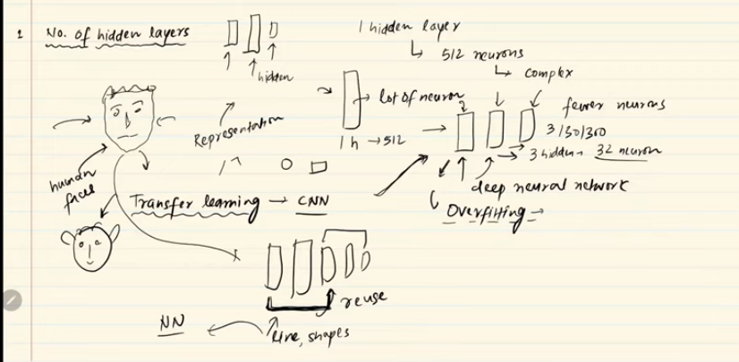
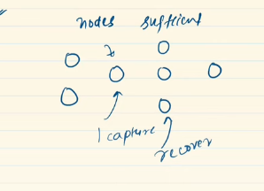
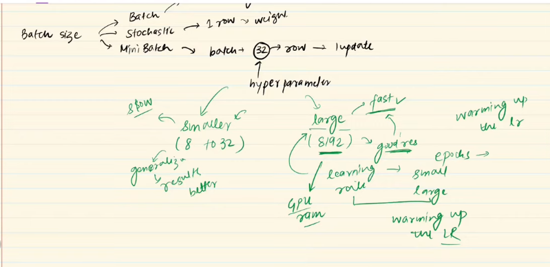
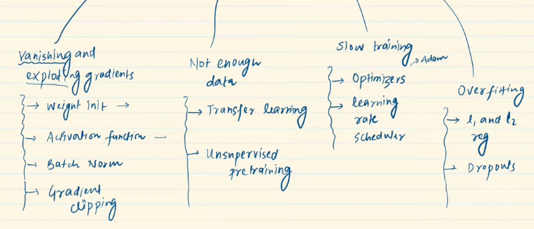

---

# How to improve the performance of `Neural Network: `

---

`আমরা অনেক গুলো technique দেখবো এর মধ্যে সব গুলোর overview দেখবো just । Details এ পরে পড়বো । tensorflow and keras ব্যবহার করে আমরা যেই neural network বানিয়েছিলাম সেইটা যে কেউ যারা tensorflow and keras ব্যবহার  করতে যানে তারা খুব সহজেই তৈঁরি করতে পারবে । আর, tensorflow and keras ব্যবহার  করে খুব সহজেই আমরা 80% accuracy পযন্ত আমাদের মডেলকে নিয়ে যেতে পারবো । কিন্ত, 80 থেকে  90 তে নিয়ে যেতে হলে আমাদের কিছু মডিফিকেশন করতে হবে । `

- `fine tuning hyperparameter: ` প্রথমে, আমাদের অনেক গুলো `hyperparameter` আছে । এইগুলোর ভ্যালু বের করা শিখতে হবে । যেমনঃ batch size এর ভ্যালু কত দিলে এইটা ঠিকঠাক কাজ করবে,neural network এর accuracy বাড়বে তা বের করা শিখতে হবে । `hyperparameter` গুলো হলোঃ 
    - epoch
    - hidden layer
    - neuron per layer/ nodes
    - learning rate
    - optimizer
    - batch size
    - activation function

-  `Neural Network ` গুলো করার সময় আমরা কত গুলো প্রবলেমে ফেইস করি । যেমনঃ আগের লেকচারে আমরা দেখেছি এমন কিছু প্রবলেম ও আরো কিছু সমস্যা (উপরের ছবিতে দেখানো হয়েছে) সেইগুলোর সমাধান করে । 

---
# Number of `hidden layer:`

- `আমরা ইচ্ছে করলে একটা hidden layer দিয়ে এর মধ্যে অনেক গুলো node দিয়ে আমাদের complex সমস্যার সমাধান পযন্ত করতে পারি । কিন্তু, এর থেকে  ভালো approach হলো যে, অনেক গুলো hidden layer ব্যবহার করে প্রত্যেক hidden layer এ অল্প কিছু node ব্যবহার করা । যেমনঃ face recognition এর ক্ষেত্রে প্রথম hidden layer, primitive features (edges,lines) সনাক্ত করবে তারপর দ্বিতীয় hidden layer বা middle layers গুলো (সেই primitive features গুলো দিয়ে shape বানাবে), last(সেই shape গুলো দিয়ে face বানাবে)। `

- `এখন কতক্ষন পর্যন্ত আমরা hidden layer add করতে থাকবো ?`  উওর হচ্ছে,  যতক্ষন না পযন্ত neural network এ overfitting হচ্ছে ।   

- `multiple hidden layer ব্যবহার করার আর একটা সুবিধা হচ্ছে । **Transfer Learning** ` এইখানে হয় যে, আমরা একটা  neural network দিয়ে একটা মানুষের face recognition এর জন্য ব্যবহার করলাম । তারপর সেইটাকে আমরা যদি একটা বানরের চেহারা recognition এর জন্য ব্যবহার করতে চায় তাহলে বানর আর মানুষের face এর মধ্যে একটা মিল আছে । এর জন্য আমরা প্রথম কয়েকটা neural network এর hidden layer আগের মতো ব্যবহার করে বাকী গুলো আবার নতুন ভাবে train করতে পারবো । আর এইটাকে Transfer Learning বলে । 

---

# প্রত্যেক লেয়ারে আমাদের কতগুলো  Neuron or Node থাকবেঃ 

- `input layer এ যত গুলো থাকবে তত গুলো Node করতে হবে । `

- `input layer এ আমরা কোন ধরনের সমস্যা সমাধান করতেছি তার উপর নির্ভর করে । যেমনঃ Multi-Class-Classification প্রবলেম এর জন্য যত গুলো class থাকবে তত গুলো node থাকবে output layer এ । Regression প্রবলেমের ক্ষেত্রে একটা output layer এ একটা  node থাকবে । `

- `Middle Hidden Layer গুলো তে, আগে মনে করা হতো pyramid sturacture (সামনের দিকে আগানোর সাথে সাথে number of node decrease) ফলো করে দিলে result accurate আসবে কিন্তু্‌  exprimenty node number input layer এর  node  সমান হলেও সেম accurate result দেয়।  `

- `কিন্ত, আমরা এমন ভাবে Middle Hidden Layer দিব না যাতে মাঝখানের কোন একটা Hidden Layer এর node number অনেক অনেক কম হয় তাহলে আমাদের অনেক  feature missing হয়ে যাবে ।`

---

# learning rate and optimizer

`আমরা যখন slow traning প্রবলেম solve করবো তখন learning rate and optimizer শিখবো । `

---

# Batch Size:

- `Batch and Stochastic আমরা Gradient Descent এ দেখেছি। `

- ` অন্যদিকে Batch size অনেক বেশি বা কম ও দিতে পারি । `
    - Batch size কম দিলে train হতে সময় বেশি লাগবে । 
    - Batch size বেশি দিলে  train হতে সময় কম লাগবে কিন্তু gpu and ram বেশি লাগবে । Batch size বেশি দিলে Warming Up( traning learning rate ) technique follow করলে ভালো result  পাওয়া যায় । 

---

# Epoch

`আমরা Epoch, 100,500,1000 রাখতে পারি । আর **early stopping** নামে একটা technique আছে যেইটা আমাদের model stable কি না তা check করে । Model Stable বলতে বুঝায়ঃ আমাদের model এর  last কয়েকটা Epoch  এ model এর accuracy তেমন change হচ্ছে না । `

---
# Some Problem :

   

`আজকে লেকচারে যা যা বলা হয়েছে সবগুলো শিখলে আমরা ভালো ভাবে neural network train করতে পারবো । `

   

---

