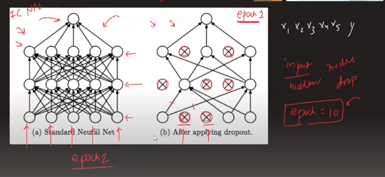
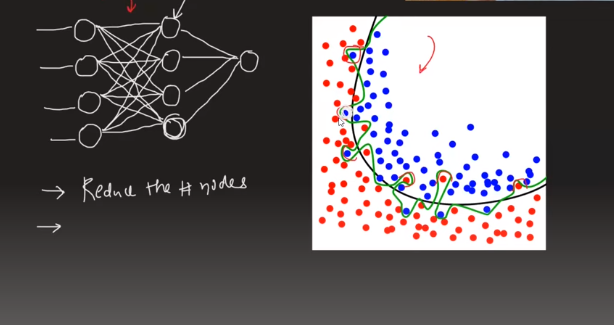

---

# Droping Layer In a Neural Network:

---

`যখন আমাদের overfiting প্রবলেম দেখা দেয় তখন আমরা Droping Layer ব্যবহার করি । `

# What is Overfiting?

Overfitting in machine learning occurs when a model learns to perform well on the training data but fails to generalize well to new, unseen data.

উপরের ছবিতে, Green MOdel টি Test ডাটার pattern কে learn করে একটা complex মডেল তৈরি করেছে যেইটা ভালো ভাবে কাজ করবে শুধু test data এর উপর। কিন্তু, নতুন কোন data উপর ভালো ভাবে কাজ করবে না তার complex এর কারণে । Neural Network or ANN এ অনেক Node থাকে, তারপর একে আমরা অনেক গুলো epoch দিয়ে train করি যা একটা complex pattern তাই, Overfiting হওয়ার সম্ভবনা অনেক বেশি থাকে । 

 

### Possible Solutions:

-   Add more data

-   Reduce Complexity

-   Early Stopping

-   Regularization

    - ridge regression (L1) 
    
    - lasso regression (L2)
    
-   Dropout

  

# The Concept of Dropouts:

`উপরের প্রবেলেমে আমরা input and hidden layer থেকে  randomly একটা নিদিষ্ট সংখ্যক nuron বা node  কে  neural network থেকে শুধু মাত্র একটা নির্দিষ্ট epoch এর জন্য disable করে দিব । পরর্বতী, আরেকটা epoch এর জন্য সেই নিদিষ্ট সংখ্যক nuron বা node কে randomly আবার disable করে দিব । অর্থাৎ, আমরা যদি 10 টা epoch চালাই তাহলে, আমরা 10 টা neural network train করতেছি । এর মাধ্যমে accuracy 2%  এর মতো increase করে । `

---

# Why Dropout layers work well:

`উপরের ছবিতে, মডেল টি যদি কোন একটা single data point এর উপর focus  না করে তাহলে আমরা Overfiting থেকে বাচতে পারবো । আর Dropout layers কোন একটা single data point এর উপর focus না করে সব data point এর উপর focus করে । `

- `আমরা প্রথমে p এর ভ্যালু সেই করবো  । Input Layer(p=0.5, 50%) এবং Hidden Layer(p=0.5, 50%) এর জন্য । সেই অনুযায়ী এবং থেকে প্রতেক epoch এ  disable হতে থাকবে । `

- `যখন আমরা 4 টা বা 100% node use করেছি তখন কোন একটা node এর weight এর prority অনেক বেশি হয়ে যাচ্ছে । কিন্তু, Dropout layers এর কারণে আমরা সেই ঝামেলা থেকে মুক্ত পাচ্ছি । `

---

