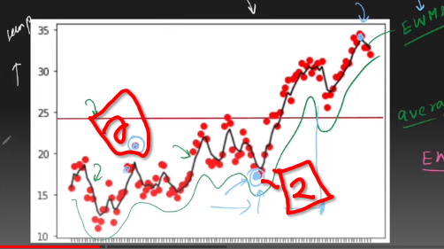
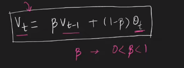
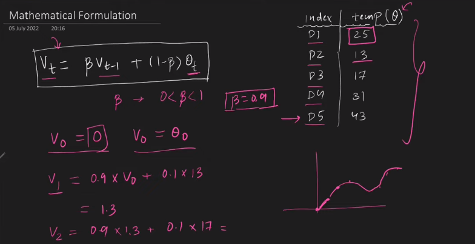
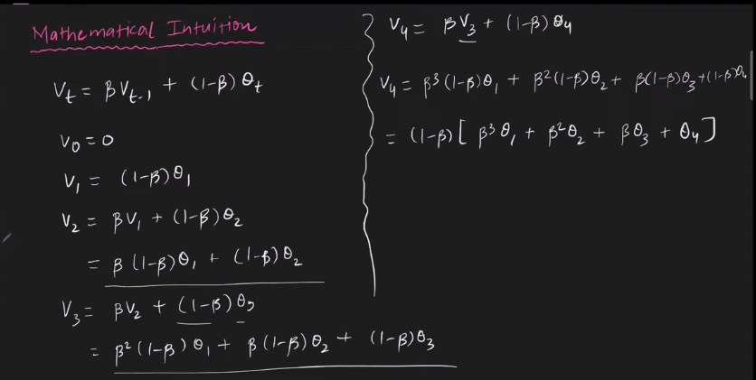

---

# Exponentially Weighted Moving Average

---

`আমাদের কাছে time serics এর কিছু ডাটা আছে, যেইটা দিয়ে আমরা একটা গ্রাফ বানিয়েছি X-axis এ dates, y-axis এ temperature । অর্থাৎ, time serics হলো এমন dataset যেই খানে  time এর সাথে সাথে value change হয় । উপরের ছবিতে, মাঝখান দিয়ে যেই line চলে গেছে সেইটা হলো average black line টা হলো EWMA(Exponentially Weighted Moving Average.) । `

## Uses of EWMA:

- `Time Series Forecasting `
- `Financial Serics Forecasting `
- `Signal Processing `
- `Deep Learning for making Optimizer `

- `Finally, শুরুর দিকের weightage (ছবিতে ১ নং) এর চেয়ে পরের গুলোর weightage (ছবিতে ২ নং) বেশি হবে । আর, সময়ের সাথে সাথে কোন particular point এর weightage কমতে থাকে । `

# Mathematical Formula:

- `V(t-1) হচ্ছে t সময়ের আগের সময়ের যেমনঃ day2 হলে day1 এর  value ।`
- `Beta এর মানের range (0~1) মধ্যে হয়ে থাকে । `
- `Theta(t) হচ্ছে t সময়ে data এর value । `

`শুরুতে, Vo = 0 বা   Vo = (theta_not) দুইটায় ব্যবহার করা যায় । কিন্তু, V0 = (theta_not) ব্যবহার করা ভালো । উপরে আমরা Vo = 0 ধরে, calculation করেছি, আর এর পাশে আমরা তার গ্রাফ বানিয়েছি ।  ` 

`আমরা যদি Beta এর মান 0.9 set করি তাহলে কোন একটা particular point এ সেই point থেকে উপরের মতো calculation করলে আমাদের Exponentially Weighted Moving Average এর মান Normal last 10 days average এর মতো behave করবে ।`

`Beta এর মান বেশি হলে আমরা পুরানো value গুলো কে  weightage বেশি দিচ্ছি । আর যত কম হবে তত আমরা নতুন value গুলো কে  weightage দিচ্ছি । `

### Beta এর মান কম । 

### Beta এর মান বেশি । 

`Beta এর মান বেশি হলে তাকে moody  বলবো কারণ, কোন decision এর জন্য এরা past এর data এর উপর depend  করতেছে । অন্যদিকে,Beta এর মান কমে হলে তারা present এর উপর নির্ভর করে । `

# Mathmatical Intuition:

`উপরের ছবি থেকে আমরা clear যে Beta এর মানের উপর নির্ভর করে আমরা নতুন ভ্যালু আসার সাথে সাথে আমরা তাদেরকে weightage বেশি দিতেছি বা কম দিতেছি । `

---

## see code demo 

---

