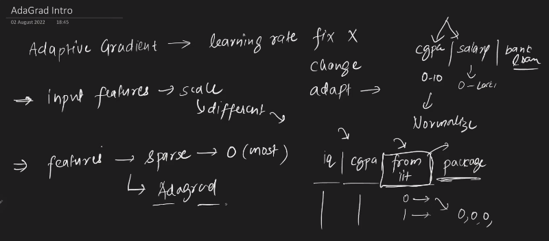
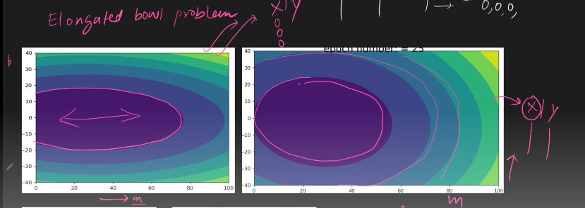
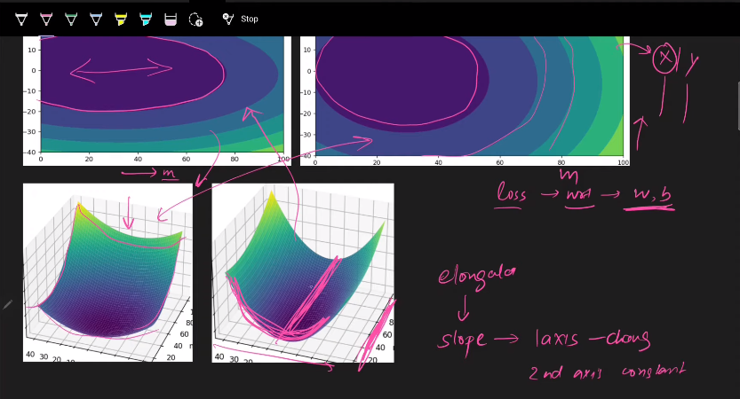
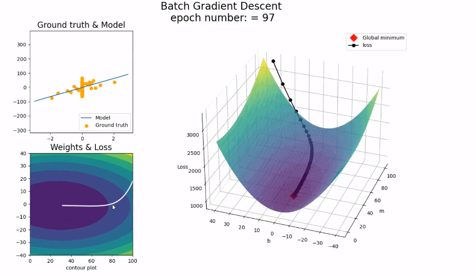

---

#  AdaGrad (Adaptive Gradient Algorithm)

---

`AdaGrad-> Adaptive Gradient । সময়ের সাথে সাথে learning rate change হয় বা learning rate নিজেকে adopt করে । AdaGrad আমরা ব্যবহার করবোঃ `

- `i)  যদি আমাদের Input Feature scale different  হয় । Generally, আমরা ডাটাকে Normalize or Scaling (In scaling, you're changing the range of your data, while. in normalization, you're changing the shape of the distribution of your data) করি ML or Dl Algorithrm করার আগে । সেক্ষত্রে, AdaGrad ভালো perform করে না ।  `

- `ii) আমাদের feature এ যদি অনেক sparse value  থাকে । In our dataset for a particular column(from IIT) most of the value is zero । `

#### `Feature, sparse  হলে Elongated Bowl Problem  দেখা দেয় । `

`Feature, sparse হলে আমাদের contour plot, circle এর পরির্বতে একটু ellipse আকারের হয়ে থাকে। `

`উপরের ছবি গুলো 3D । আমাদের ডাটাসেটে এমন ভ্যালু হলে এক axis এ solpe change হয় অন্য axis এ solpe change হয় না। এই সমস্যাকে solve করে AdaGrad । `

### Let's see SGD, Momentum Optimization, NAG এ কি প্রবলেম হচ্ছে । 

