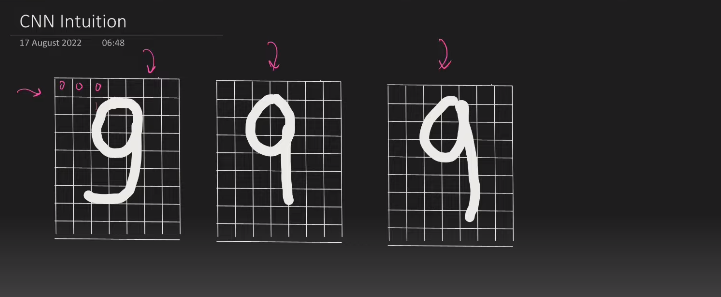
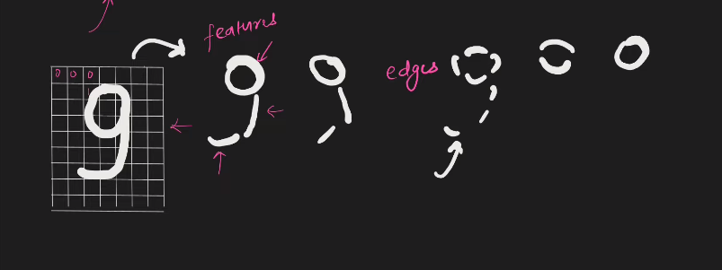
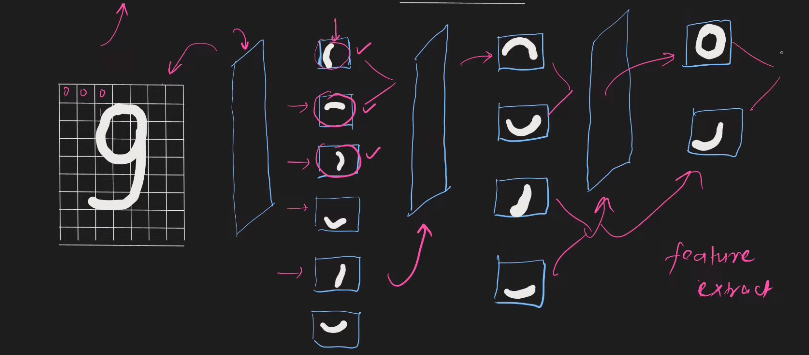
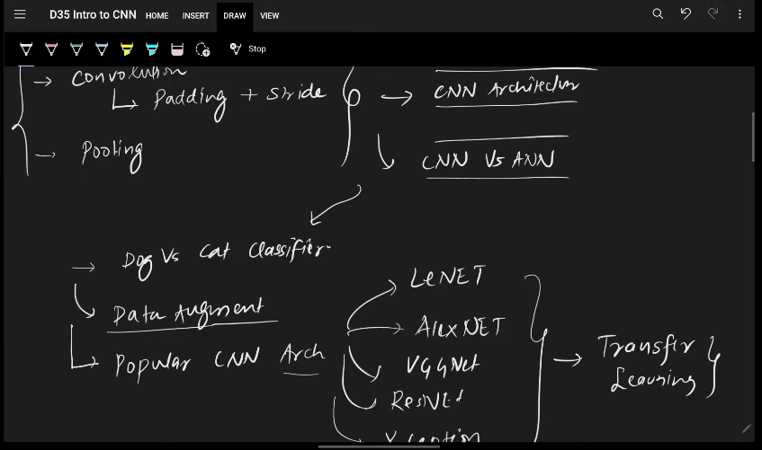

---

# What is CNN

---

`ANN এ আমরা Matrix Multiplication Use করি অন্যদিকে CNN এ Convolution layer নামে একধরনের layer থাকে সেই layer গুলোতে আমরা একটা special operation perform এই operation কে  Convolution Operation বলে । ছবিতে, convolution layer এর নিচে convolution লিখা আছে । যদি কোন Neural Network এ একটাও Convolution layer থাকে তাহলে আমরা বুঝতে এখানে CNN করা হয়েছে । CNN এ ৩ ধরনের layer থাকেঃ `

- `Convolution layer`
- `Pooling layer`
- `FC layer or Fully Connected layer also in ANN`

 

 

 

### CNN is Inspired From Human Vision (Visual Cortex)

`CNNs were pioneered by Yann LeCun, Leon Bottou, Yoshua Bengio, and Patrick Haffner in the late 1980s and early 1990s. Their initial purpose was to process visual data for tasks such as handwritten digit recognition.`

# ANN Vs CNN

`আমরা CNN এর প্রবলেম গুলো ANN দিয়ে করতে পারি । যেমনঃ MNIST Data set এ আমরা ANN 98% Accuracy অর্জন করেছিলাম ।  কিন্তু, এতে আমরা কিছু সমস্যার সম্মুখীন হই ।  `

- `High Computational Cost: ANN এ Image কে input দেওয়ার জন্য 2D image কে আমরা 1D তে convert করে Row by Row উপরের চিত্রের মতো input দেই । আমাদের কাছে যদি 40x40 এর একটা image থাকে তাহলে 40*40 = 1600 আর যদি input layer এ 100 node থাকে তাহলে আমাদের  input layer weight হবে 1600*100 = 160000 আর যদি ছবিটা 1000x1000  আকারের হয় তাহলে তো আর কোন কথায় নেই 1000*1000*100 = 100000000 weight হবে । `

- `Overfitting: আমরা যেহেতু ছবির row by row input এ দিতেছি, এর ফলে image এর minor জিনিস গুলোও capture  হবে এর ফলে  Overfitting prbolem হবে । `

- `Loss of important information like spatial arrangement of pixel: 1D তে ডাটা input দেওয়ার ফলে আমরা ছবিতে বানরটির eye,nose আর mouth এর মধ্যকার দুরত্ব হারিয়ে ফেলবো এর ফলে এইটা কার চেহারা সেইটা identify করতে পারবো না। `

# Intution of CNN:

#### `একটা ছবিতে 9 আছে কি না তা CNN দিয়ে দেখবো । `

#### `Brain কীভাবে বুঝে যে একটা লিখা আছে আর সেই লিখাটা হচ্ছে ৯  । `

`প্রথমে আমাদের brain ছবি গুলো ভাগ করে prattern খুঁজে যে এর মধ্যে একটা circle একটা  horizontal line আর একটা vertical line আছে কি না । থাকলে, সেই ছবিতে থাকা সংখ্যাটি ৯ হওয়ার সম্ভবনা অনেক বেশি । CNN প্রথমে identify করে edges কে তারপর আরেকটা complex structure বা feature (semi-circle) বানায়, তারপর আর একটু  complex structure বা feature (circle) বানায় এইভাবে একটা ছবিকে identify করে CNN ।  `

`প্রথমে আমরা একটা ছবিতে filter move করিয়ে দেখি existing কিছু feature ( primitive feature, or edges ) ছবিতে আছে কি না । থাকলে সেই feature গুলো active গুলো যায় । তারপর, activated feature গুলো একটা convolutional layer এর মধ্য দিয়ে যেয়ে আর একটা complex pattern make করে তারপর আরেকটা convolutional layer এর মধ্য দিয়ে যেয়ে আরেকটু complex pattern তৈরি করার মাধ্যমে কোন ছবিকে identify করে ।  This process is called feature extraction । `

# Use of CNN:

- `Image Classification: কোন একটা image এ কিসের ছবি আসে । বাঘ, ভাল্লুক etc. `

- `Object Localization : কোন একটা Object এর  Location যেনে তার চার পাশে rectangular box দিয়ে bound করা ।  `

- ` Object Detection: Use in self-driving car.`

- ` Face Recognition : `

- `Image segmentaion: Image কে বিভিন্ন segment এ divide করা। Use in self-driving car. `

- `Super Resolution : কোন ছবির resolution বাড়াতে পারি । `

- `Convert Black white photo into color photo.`

- `Pose ditection of a human. `

# Roadmap:

