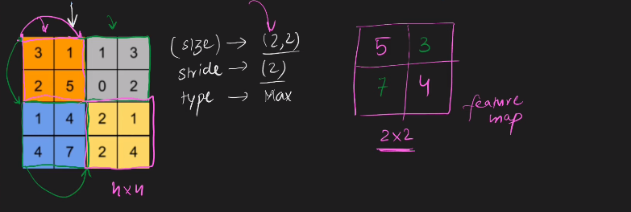
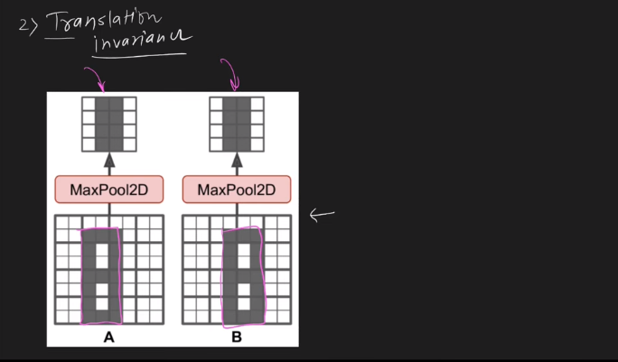
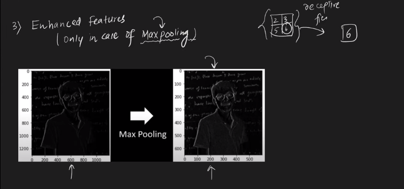
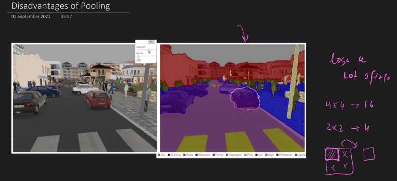

---

# Pooling in CNN:

---

`Convolution Operation করলে আমাদের দুই ধরনের সমস্যা হতে পারে । i) Memory Issue ii) Translation Variance । `

- `Memory Issue: `

`ধরি, আমাদের কাছে 228x228x3 একটা image আছে যেইখানে আমরা 100 টা filter use করবো । তাহলে আমাদের feature map এর dimention হবে 226*226*100 । আমরা যদি 32 bit flooting v ব্যবহার করি তাহলে (226*226*100*32) = 19MB এর মতো শুধু মাত্রে একটা ডাটা সেটের জন্য র‍্যামে  19MB data load করতে হবে । আর, আমাদের কাছে যদি 100 টা batch থাকলে র‍্যামে আমাদের 1.9 GB data load করতে হবে । যেইটা খুব inefficient । Strides use করলে আমরা Memory Issue সমস্যার সমাধান করতে পারি । কিন্তু, Strides, Translation Variance এর সমস্যাটির সমাধান করতে পারে না ।  `

- `Translation Variance: `

` Convolution Operation এর কাজ হচ্ছে feature খুঁজে বের করবে কিন্তু, সেইটা হবে location depended । Image classification এর ক্ষেত্রে আমরা দুইটা ছবি classify করতে যাবো, যেমন: ধরি বিড়ালের ক্ষেত্রে Convolution Operation যদি location depended হয় তাহলে বিড়ালের কান যদি দুইটা ছবিতে  দুই জায়গায় হয় তাহলে দুইটা ছবিকে আমাদের মডেল আলাদা আলাদা ভাবে Treat করবে । এই prb কে সমাধানের জন্য আমরা pooling use করি ।   `

# Pooling:

`Convolution Operation করার সময় relu activation function ব্যবহার করি ফলে আমাদের feature map এ non-liner ডাটা capture হয় । Non-linear feature map পাওয়ার পর আমরা pooling করি । Pooling হয়ে থাকে i) Max pooling ii) Min pooling iii) Average pooling iv) L2 pooling v) Global pooling .  `

`Picture এ যেই 4x4 দেখা সেইটা হচ্ছে  Non-linear feature map । pooling করার জন্য আমাদের তিনটা হচ্ছে i) size,generally (2x2) হয়ে থাকে । ii) stride, generally 2 । iii) type (max pooling) । Output হিসেবে 2x2 এর feature map পাবো । size (2x2) হওয়ার আর type = (max pooling) হওয়ার প্রথম ক্ষেত্রে, max(3,1,2,5) =5, max(1,3,0,2)=3, max(1,4,4,7) = 7, max(2,1,2,4) = 4, feature map[5,3,7,4] । `

 

`Hence, Pooling type (max Pooling) তাই, আমরা max ভ্যালু নিতেছি । আর, যদি আমরা Pooling type (Min Pooling) নেই তাহলে Min ভ্যালু নিব । Average pooling এ আমরা Average ভ্যালু নেই । Max Polling এ আমরা নিতেছি ।  `

# Demo:

### [visulize_website_link](https://deeplizard.com/resource/pavq7noze2)

# Pooling of Volumes:

` যদি আমাদের  Feature map একটা volume হয় সেক্ষেত্রে, আমরা প্রথমে 1st layer then 2nd layer এ pooling apply করবো ।  `

 
---

# Code implementation of max pooling in keras

(max pooling এ model.summary() tarning Parameter = 0 )

---
 

# Advantage of pooling:

### ` Reduce Size: `

### `Translation in variance: Independent from Location.`

### `Enhanced Features (only for max pooling )`

- `max pooling এ আমরা শুধু maximum value নিতেছি যেইটা শুধু higher feature কে extract করে ।`

### `No Need Of Traning: `

`(beacuse max pooling হচ্ছে aggregate operation. )`

# Types of pooling:

`Global maxpooling এ আমরা  1D array তে convert করি । maximum value নেই । `

# Disadvantage of pooling:

- `In image segmentation, we don't use pooling beacuse location matters . `

- `We loose a lot of information. `

