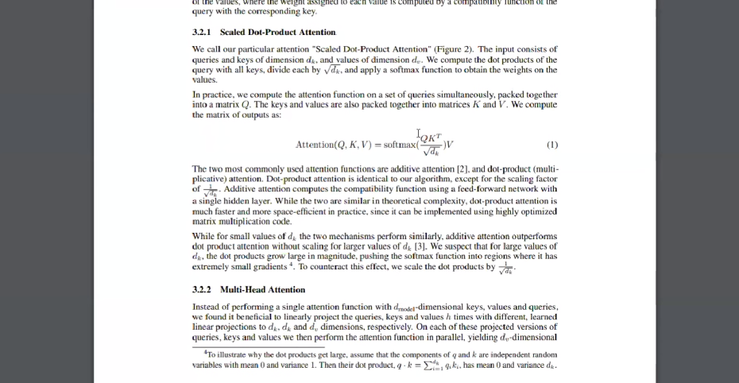
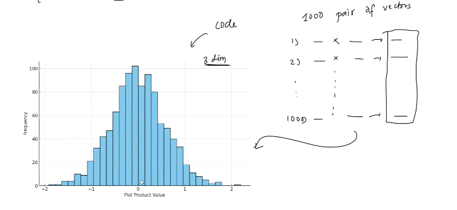
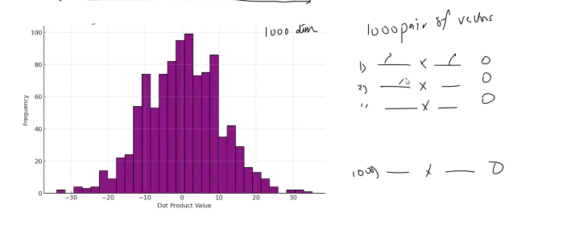
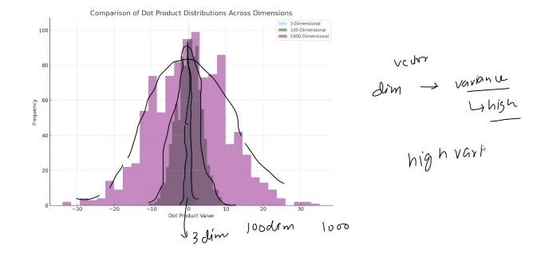
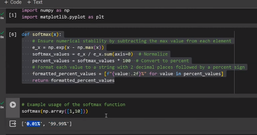

 
 

# Why we do scale in Self Attention ? : 

 
 

From our previous lecture,if our Query vector is (Q), Key vector is (K) and the Value vector is (V) then our self attention equation be like: 

 

 

But if we see the research paper then we will see that, they scale the self attention:

 

 

`Why we scale it? To get rid from unstable gradient`. But  why we scale with $\sqrt{d_k}$ and what is $(d_k)$ ? $d_K$ `is the dimention of the key vector.` In our previous example, the Key vector of $K_(money) $, $K_(bank)$, $K_(grows)$ is same and `the value was three(3). Hense, in our case,`  $\sqrt{d_k}$ = $\sqrt{3}$ . In, one line ans we can also said that we divide with  $\sqrt{3}$ beacuse of `the nature of the dot product`.

 

`এখানে আমরা,` $\dot{Q,K^T}$ `করতেছি । একটি কলাম ও অন্যটি রো matrix , করার ফলে আমরা (3x3) dimentional এর একটা matrix পাচ্ছি । এখানে, আমরা 9 টা নাম্বার পাচ্ছি, এই নাম্বার গুলোর এখন আমরা mean, deviation  করতে পারবো । কিন্তু, fact হচ্ছে, base on (the nature of the dot product)` 

- from low dimentional vector's dot product we got low variance .
- from high dimentional vector's dot product we got high variance .

`আমরা ১০০০ রো এর দুইটা matrix একবার গুণ করে তাদের পল্ট করে তাদের variance তুলনা করার চেষ্টা করছি । প্রথমে, ছবিতে ৩ , ১০০, ১০০০ হলে তাদের কেমন হবে তা নিচের ছবি গুলোতে দেখানো হলো।  `

 

### `# 3 dimentional`

 

 

### `# 1000 dimentional`

 

 

### `# 3, 100, 1000 dimentinoal vector's histrogram and from here we can get their variance.`

 

 

#### `Hense, we can say that, From low dimentional vector's dot product we got low variance. From high dimentional vector's dot product we got high variance .`

 
 

# `# Now, we will study about softmax function nature: `

The equation for the **softmax function** is used to convert raw scores (logits) into probabilities, commonly applied in the output layer of neural networks for classification tasks. Here's the mathematical formula:

### Softmax Function:

Given a vector  $\mathbf{z} = [z_1, z_2, ..., z_n]$ , the softmax function $\sigma(\mathbf{z})_i$ for each component $z_i$ is defined as:

$\sigma(\mathbf{z})_i = \frac{e^{z_i}}{\sum_{j=1}^{n} e^{z_j}}$

Where:
- $\sigma(\mathbf{z})_i$ is the probability for the i-th class.
- $z_i$ is the i-th element of the input vector $\mathbf{z}$ the raw score or logit for class i.
- n is the total number of classes.
- e is Euler's number (approximately 2.718).

` অর্থাৎ softmax আমাদের কে  probability হিসেবে আউটপুট করে । এখন দুইটা নাম্বারের মধ্যে  variance কম হলে (যেমনঃ ৪,৫ ) এর ক্ষেত্রে  softmax  তাদেরকে কাছাকাছি দুইটা probability দেয় । কিন্তু, যদি দুইটা নাম্বারের মধ্যে  variance বেশি হলে (যেমনঃ ১,১০ ) এর ক্ষেত্রে  softmax তাদেরকে কাছাকাছি দুইটা probability দেয় । নিছের ছবি তে উদাঃ গুলোর কোড implementation দেওয়া হলো । ` 

 

 

 

# `# High variance সমস্যা কি?`

 

`সমস্যা হচ্ছে, যখন আমরা backpropagration করবো তখন softmax এর পরে আমরা যেই value পাবো, তাদের মধ্যে কিছু বড় হবে আর কিছু ছোট হবে (because of nature of softmax) । এর ফলে  backpropagration এর সময় বড় ভ্যালু গুলো priority বেশি পাশে আর ফলে ছোট ভ্যালু গুলো update হবে না ফলে, vinishing gradient problem দেখা দিবে ।  `

 

 

